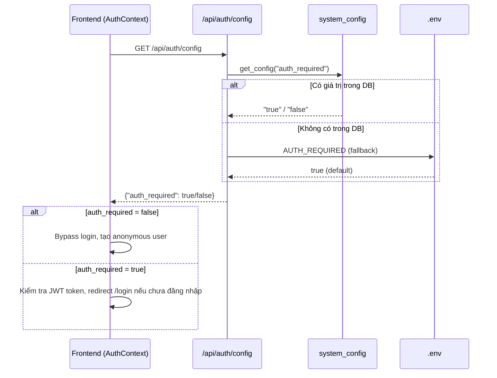

# API: Engine Settings

Quản lý cấu hình engine runtime (AI toggle, AI concurrency, file scan limit, authentication toggle, regression thresholds) — thay đổi từ UI mà không cần restart.

## `GET /api/settings/engine`

**Mục đích:** Lấy cấu hình engine hiện tại (đọc DB, fallback .env).

> [!NOTE]
> Nếu persistence chưa sẵn sàng (`DATABASE_URL` thiếu hoặc Postgres unreachable), endpoint này vẫn trả cấu hình effective từ `.env`/default.

**Response (200):**
```json
{
  "status": "success",
  "data": {
    "ai_enabled": false,
    "ai_mode": "realtime",
    "ai_max_concurrency": 5,
    "test_mode_limit_files": 1,
    "openai_batch_model": "gpt-4.1-nano",
    "openai_batch_api_key_configured": false,
    "member_recent_months": 3,
    "auth_required": true,
    "regression_gate_enabled": true,
    "regression_score_drop_threshold": 2.0,
    "regression_violations_increase_threshold": 5,
    "regression_pillar_drop_threshold": 0.5,
    "regression_new_critical_threshold": 1
  }
}
```

## `PUT /api/settings/engine`

**Mục đích:** Cập nhật cấu hình engine (upsert vào bảng `system_config`).

**Request Body (partial update):**
```json
{
  "ai_enabled": true,
  "ai_mode": "openai_batch",
  "ai_max_concurrency": 8,
  "test_mode_limit_files": 0,
  "openai_batch_model": "gpt-4.1-nano",
  "openai_batch_api_key": "sk-***",
  "member_recent_months": 6,
  "auth_required": false,
  "regression_gate_enabled": true,
  "regression_score_drop_threshold": 3.5,
  "regression_violations_increase_threshold": 8,
  "regression_pillar_drop_threshold": 0.8,
  "regression_new_critical_threshold": 2
}
```

**Response (200):**
```json
{
  "status": "success",
  "data": {
    "ai_enabled": true,
    "ai_mode": "openai_batch",
    "ai_max_concurrency": 8,
    "test_mode_limit_files": 0,
    "openai_batch_model": "gpt-4.1-nano",
    "openai_batch_api_key_configured": true,
    "member_recent_months": 6,
    "auth_required": false,
    "regression_gate_enabled": true,
    "regression_score_drop_threshold": 3.5,
    "regression_violations_increase_threshold": 8,
    "regression_pillar_drop_threshold": 0.8,
    "regression_new_critical_threshold": 2
  }
}
```

**Response (400):**
```json
{
  "detail": "ai_max_concurrency phải nằm trong khoảng 1..100"
}
```

**Response (503):**
```json
{
  "detail": "Database-backed persistence is unavailable because DATABASE_URL is not configured or Postgres could not be reached."
}
```

## `GET /api/auth/config`

**Mục đích:** Public endpoint (không cần token) — Frontend dùng để kiểm tra xem hệ thống có yêu cầu đăng nhập hay không **trước khi** hiển thị trang Login.

**Response (200):**
```json
{
  "auth_required": true
}
```

## Ghi chú kiến trúc

- Config lưu trong bảng `system_config` (key-value store)
- Ưu tiên đọc: **DB → .env** (fallback)
- Runtime reload: không cần restart container
- `PUT /api/settings/engine` yêu cầu DB-backed persistence; hệ thống không giả lập lưu settings trong memory cho endpoint này.
- Helper functions: `get_ai_enabled()`, `get_ai_max_concurrency()`, `get_test_mode_limit()`, `get_auth_required()` trong `src/config.py`
- `openai_batch_api_key` chỉ dùng ở request; response chỉ trả `openai_batch_api_key_configured` để tránh lộ secret.
- Regression Gate là `soft warning`, không chặn scan/job; giá trị cấu hình chỉ quyết định ngưỡng đánh dấu `warning` cho các lần scan tiếp theo.
- Các key regression hiện tại trong `system_config`: `regression_gate_enabled`, `regression_score_drop_threshold`, `regression_violations_increase_threshold`, `regression_pillar_drop_threshold`, `regression_new_critical_threshold`.

### Luồng Authentication Toggle



### Cảnh báo bảo mật

!!! warning "Tắt Authentication"
    Khi `auth_required = false`, mọi người có quyền truy cập mạng đều vào được Dashboard mà không cần đăng nhập. Chỉ nên sử dụng trong môi trường **local development** hoặc **demo**.
