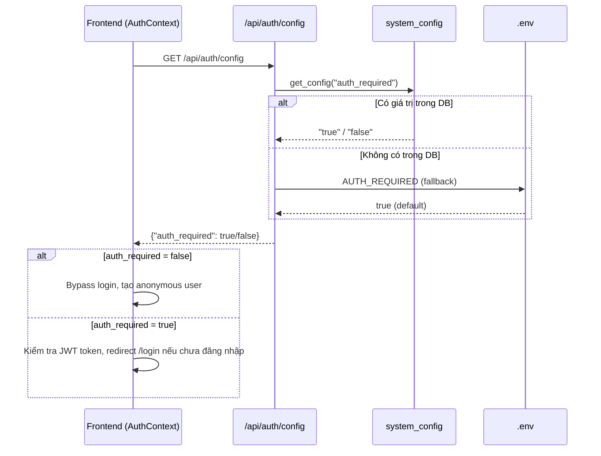

# API: Engine Settings

Quản lý cấu hình engine runtime (AI toggle, AI concurrency, file scan limit, authentication toggle) — thay đổi từ UI mà không cần restart.

## `GET /api/settings/engine`

**Mục đích:** Lấy cấu hình engine hiện tại (đọc DB, fallback .env).

**Response (200):**
```json
{
  "status": "success",
  "data": {
    "ai_enabled": false,
    "ai_max_concurrency": 5,
    "test_mode_limit_files": 1,
    "auth_required": true
  }
}
```

## `PUT /api/settings/engine`

**Mục đích:** Cập nhật cấu hình engine (upsert vào bảng `system_config`).

**Request Body (partial update):**
```json
{
  "ai_enabled": true,
  "ai_max_concurrency": 8,
  "test_mode_limit_files": 0,
  "auth_required": false
}
```

**Response (200):**
```json
{
  "status": "success",
  "data": {
    "ai_enabled": true,
    "ai_max_concurrency": 8,
    "test_mode_limit_files": 0,
    "auth_required": false
  }
}
```

**Response (400):**
```json
{
  "detail": "ai_max_concurrency phải nằm trong khoảng 1..100"
}
```

## `GET /api/auth/config`

**Mục đích:** Public endpoint (không cần token) — Frontend dùng để kiểm tra xem hệ thống có yêu cầu đăng nhập hay không **trước khi** hiển thị trang Login.

**Response (200):**
```json
{
  "auth_required": true
}
```

## Ghi chú kiến trúc

- Config lưu trong bảng `system_config` (key-value store)
- Ưu tiên đọc: **DB → .env** (fallback)
- Runtime reload: không cần restart container
- Helper functions: `get_ai_enabled()`, `get_ai_max_concurrency()`, `get_test_mode_limit()`, `get_auth_required()` trong `src/config.py`

### Luồng Authentication Toggle



### Cảnh báo bảo mật

!!! warning "Tắt Authentication"
    Khi `auth_required = false`, mọi người có quyền truy cập mạng đều vào được Dashboard mà không cần đăng nhập. Chỉ nên sử dụng trong môi trường **local development** hoặc **demo**.
