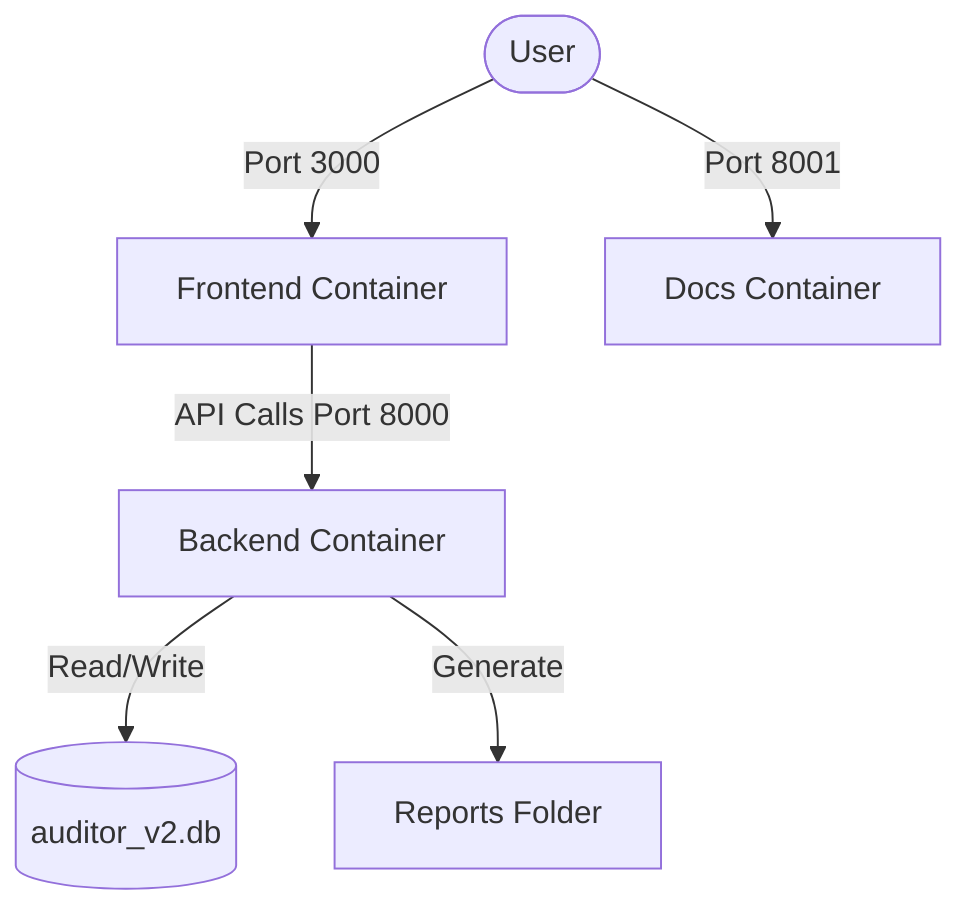

# Docker & Deployment Setup

Tài liệu này hướng dẫn cách thiết lập, vận hành và kiểm thử dự án AI Static Analysis bằng Docker.

## Kiến trúc Container

Dự án sử dụng Docker Compose để quản lý 3 dịch vụ chính:

| Service | Image | Cổng (Host) | Mục đích |
| :--- | :--- | :--- | :--- |
| `backend` | `Dockerfile.backend` | `8000` | FastAPI Server & AI Engines |
| `frontend` | `node:20-slim` | `3000` | React/Vite Dashboard |
| `docs` | `squidfunk/mkdocs-material` | `8001` | Living Documentation (MkDocs) |



## Quản lý dự án với `manage.sh`

Để đơn giản hóa lệnh Docker, bạn có thể dùng script `./manage.sh`.

### Các lệnh phổ biến:

- **Khởi động nhanh**: `./manage.sh start` (Dùng container đã build sẵn).
- **Build lại và chạy**: `./manage.sh rebuild` (Cần khi thay đổi Dockerfile hoặc requirements.txt).
- **Dừng hệ thống**: `./manage.sh stop`.
- **Xem logs**: `./manage.sh logs`.
- **Chạy Tests**: `./manage.sh test` (Thực thi pytest bên trong container backend).

## Chạy Kiểm thử (Testing)

Việc chạy test trong Docker đảm bảo môi trường đồng nhất (Environment Parity).

### Cách chạy:
```bash
./manage.sh test
```

Lệnh này thực chất sẽ chạy:
```bash
docker compose exec backend pytest tests/
```

> [!IMPORTANT]
> Luôn đảm bảo container `backend` đang chạy trước khi thực hiện lệnh test.

## Cấu hình Môi trường (.env)

Các biến môi trường quan trọng được định nghĩa trong file `.env`:
- `PYTHONUNBUFFERED=1`: Đảm bảo log Python được xuất ngay lập tức.
- `MAX_MULTIPART_FILES`: Giới hạn số lượng file upload.
- `UVICORN_TIMEOUT_KEEP_ALIVE`: Timeout cho các tác vụ phân tích dài.
