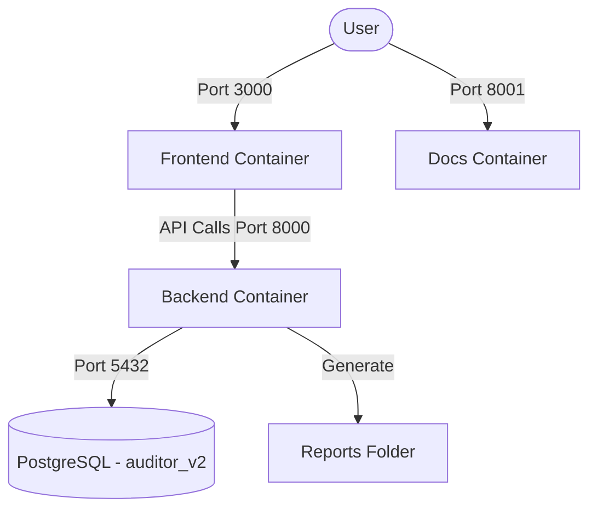

# Docker & Deployment Setup

Tài liệu này hướng dẫn cách thiết lập, vận hành và kiểm thử dự án AI Static Analysis bằng Docker.

## Kiến trúc Container

Dự án sử dụng Docker Compose để quản lý 4 dịch vụ:

| Service | Image | Cổng (Host) | Mục đích |
| :--- | :--- | :--- | :--- |
| `db` | `postgres:15-alpine` | `5432` | PostgreSQL Database |
| `backend` | `Dockerfile.backend` | `8000` | FastAPI Server & AI Engines |
| `frontend` | `node:20-slim` | `3000` | React/Vite Dashboard |
| `docs` | `squidfunk/mkdocs-material` | `8001` | Living Documentation (MkDocs) |



## Quản lý dự án với `manage.sh`

Để đơn giản hóa lệnh Docker, bạn có thể dùng script `./manage.sh`.

### Các lệnh phổ biến:

- **Khởi động nhanh**: `./manage.sh start` (Dùng container đã build sẵn).
- **Build lại và chạy**: `./manage.sh rebuild` (Cần khi thay đổi Dockerfile hoặc requirements.txt).
- **Dừng hệ thống**: `./manage.sh stop`.
- **Xem logs**: `./manage.sh logs`.
- **Chạy Tests**: `./manage.sh test` (Thực thi pytest bên trong container backend).

## Chạy Kiểm thử (Testing)

Việc chạy test trong Docker đảm bảo môi trường đồng nhất (Environment Parity).

### Cách chạy:
```bash
./manage.sh test
```

Lệnh này thực chất sẽ chạy:
```bash
docker compose exec backend pytest tests/
```

> [!IMPORTANT]
> Luôn đảm bảo container `backend` đang chạy trước khi thực hiện lệnh test.

### Auto-Reload đã bị tắt

Backend **không** sử dụng `uvicorn --reload`. Điều này cho phép:

- **Code tự do trong khi đang chạy test** mà không bị server tự restart giữa chừng.
- Tránh race condition khi test đang truy vấn database mà server bất ngờ reload.

Sau khi sửa code backend, cần **restart thủ công** container để áp dụng thay đổi:

```bash
docker compose restart backend
```

> [!TIP]
> Frontend vẫn sử dụng Vite HMR nên cập nhật tự động khi sửa JSX/CSS.

## Quy định Môi trường Bắt buộc (Mandatory)

> [!IMPORTANT]
> **Dự án AI Static Analysis CHỈ được hỗ trợ chạy trong môi trường Docker.** 
> Việc chạy trực tiếp trên máy host (Local Python) có thể dẫn đến sai lệch về phiên bản thư viện và cấu hình môi trường, gây ra các lỗi không mong muốn.

## Xử lý khi thay đổi Dependency

Khi có bất kỳ thay đổi nào trong `requirements.txt` hoặc `Dockerfile.backend`, bạn **BẮT BUỘC** phải rebuild lại container để cập nhật thư viện:

```bash
./manage.sh rebuild
```

## Troubleshooting (Xử lý sự cố)

### 1. Lỗi `ModuleNotFoundError: No module named '...'`
- **Nguyên nhân**: Container hiện tại đang dùng ảnh (image) cũ chưa có thư viện mới.
- **Giải pháp**: Chạy `./manage.sh rebuild`.

### 2. Lỗi kết nối AI (Timeout/403)
- **Nguyên nhân**: API Key trong `.env` sai hoặc Proxy/Network gặp sự cố.
- **Giải pháp**: Kiểm tra lại `.env` và chạy `./manage.sh logs` để xem chi tiết phản hồi từ AI Service.

## Cấu hình Môi trường (.env)

Các biến khởi tạo cần thiết cho ứng dụng AI (có thể copy từ `.env.example`):
- `BITBUCKET_USERNAME`, `BITBUCKET_TOKEN`: Truy cập kho lưu trữ Git/Bitbucket.
- `AI_BASE_URL`, `AI_API_KEY`, `AI_MODEL`: Thông tin cấu hình LLM Service/Proxy.
- `TEST_MODE_LIMIT_FILES`: Cấu hình số file tối đa phân tích để tiết kiệm Token trên môi trường test.

Ví dụ cấu hình khi backend chạy trong Docker và LLM router chạy trên máy host:
```env
AI_BASE_URL=http://host.docker.internal:20128/v1
AI_MODEL=cx/gpt-5.4
AI_API_KEY=your_router_api_key
```

Các biến dành cho Container (thường nằm ở môi trường của `docker-compose.yml`):
- `PYTHONUNBUFFERED=1`: Đảm bảo log Python được xuất ngay lập tức.
- `MAX_MULTIPART_FILES`: Giới hạn số lượng file upload.
- `UVICORN_TIMEOUT_KEEP_ALIVE`: Timeout cho các tác vụ phân tích dài.
