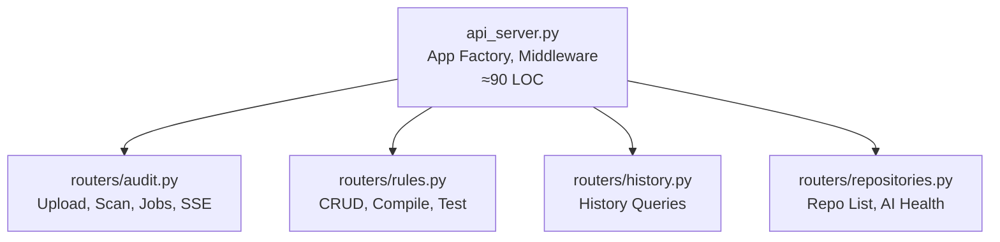
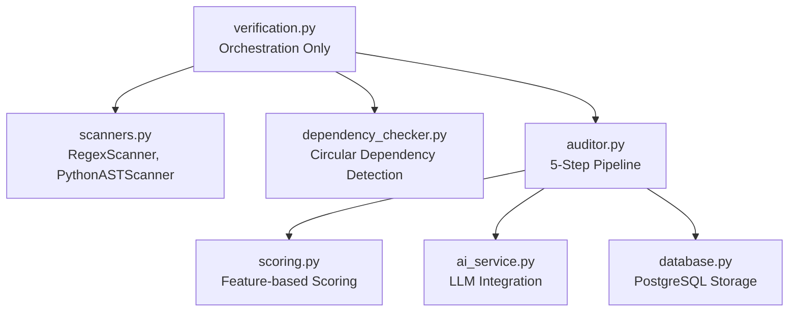
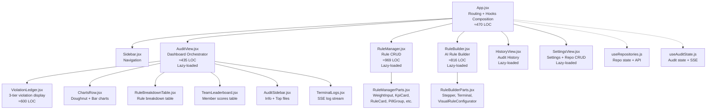

# Kiến trúc Module (Module Architecture)

Tài liệu mô tả cấu trúc module hóa sau đợt refactoring ADR-011 (2026-04-02).

## Tổng quan

Hệ thống áp dụng nguyên tắc **Single Responsibility Principle** xuyên suốt cả Backend lẫn Frontend. Mỗi file/module chỉ đảm nhận đúng 1 miền trách nhiệm.

## Backend Architecture

### API Layer (`src/api/`)

| File | Trách nhiệm | Endpoints |
|------|-------------|-----------|
| `api_server.py` | App factory, CORS, startup event, Starlette monkeypatch | `GET /` |
| `routers/audit.py` | Pipeline kiểm toán, upload file, clone Git, job management | `GET/POST /audit/*`, `GET /audit/jobs/*` |
| `routers/rules.py` | CRUD quy tắc kiểm toán, biên dịch AI, sandbox test | `GET/POST/DELETE /rules/*` |
| `routers/history.py` | Truy vấn lịch sử audit | `GET /history`, `GET /history/{id}` |
| `routers/repositories.py` | Danh sách repo cấu hình, health check AI | `GET /repositories`, `GET /health/ai` |

### Engine Layer (`src/engine/`)

| File | Trách nhiệm | Classes/Functions chính |
|------|-------------|------------------------|
| `scanners.py` | Quét mã nguồn bằng Regex và AST | `BaseScanner`, `RegexScanner`, `PythonASTScanner`, `_build_flat_meta` |
| `dependency_checker.py` | Phát hiện Circular Import cấp project | `detect_circular_dependencies` |
| `verification.py` | Điều phối: gọi scanners + dependency checker | `double_check_modular`, `VerificationStep` |

## Frontend Architecture

### Component Hierarchy (Post-Refactor 2026-04-14)

### Cấu trúc Thư mục

| Thư mục | Chứa | Mô tả |
|---------|------|-------|
| `dashboard/src/hooks/` | `useRepositories.js`, `useAuditState.js` | Custom hooks tách business logic |
| `dashboard/src/components/views/` | `AuditView`, `SettingsView` | View-level components |
| `dashboard/src/components/audit/` | `ViolationLedger`, `ChartsRow`, `RuleBreakdownTable`, `TeamLeaderboard`, `AuditSidebar` | Audit sub-components |
| `dashboard/src/components/nlre/` | `RuleManager`, `RuleBuilder`, `RuleManagerParts`, `RuleBuilderParts` | Rule management |
| `dashboard/src/components/ui/` | `TerminalLogs`, `EmptyState`, `HeroCard`, `Pagination` | Reusable UI primitives |

### LOC Summary (Trước → Sau Refactor)

| Component | Trước | Sau | Giảm |
|-----------|-------|-----|------|
| `App.jsx` | 912 | 470 | 48% |
| `AuditView.jsx` | 1,771 | 435 | **75%** |
| `RuleManager.jsx` | 1,444 | 969 | 33% |
| `RuleBuilder.jsx` | 1,216 | 816 | 33% |
| **Tổng "God Objects"** | **5,343** | **2,690** | **50%** |

### Bundle Size (Production — 2026-04-14)

| Chunk | Size | Gzip |
|-------|------|------|
| `index.js` (core) | 448 KB | 147 KB |
| `AuditView.js` | 35 KB | 9 KB |
| `RuleManager.js` | 33 KB | 9 KB |
| `RuleBuilder.js` | 36 KB | 10 KB |
| `proxy.js` (chart libs) | 130 KB | 43 KB |

---
*Cập nhật: 2026-04-14 — Phase 2 Frontend Decomposition*

