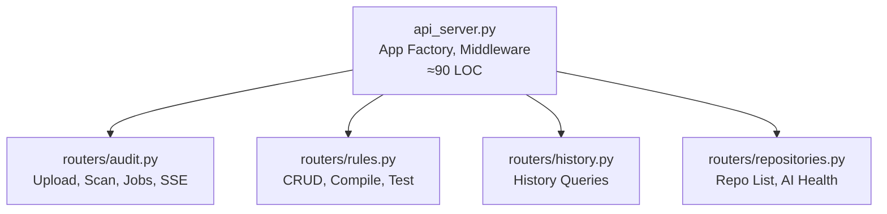
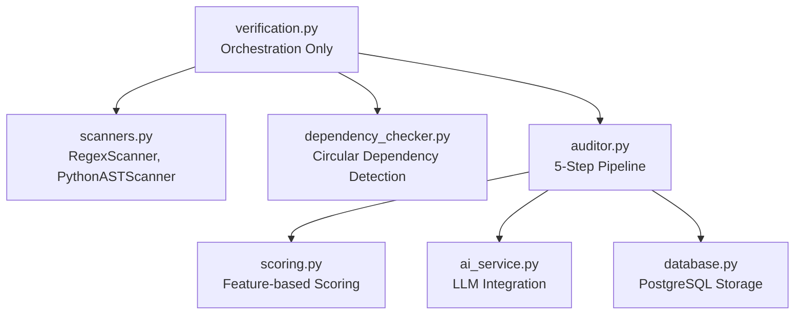
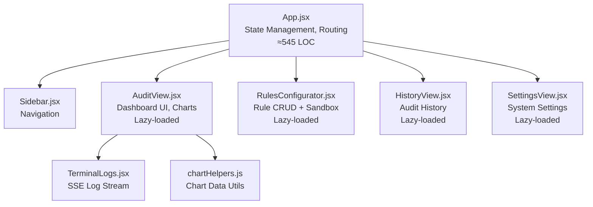

# Kiến trúc Module (Module Architecture)

Tài liệu mô tả cấu trúc module hóa sau đợt refactoring ADR-011 (2026-04-02).

## Tổng quan

Hệ thống áp dụng nguyên tắc **Single Responsibility Principle** xuyên suốt cả Backend lẫn Frontend. Mỗi file/module chỉ đảm nhận đúng 1 miền trách nhiệm.

## Backend Architecture

### API Layer (`src/api/`)

| File | Trách nhiệm | Endpoints |
|------|-------------|-----------|
| `api_server.py` | App factory, CORS, startup event, Starlette monkeypatch | `GET /` |
| `routers/audit.py` | Pipeline kiểm toán, upload file, clone Git, job management | `GET/POST /audit/*`, `GET /audit/jobs/*` |
| `routers/rules.py` | CRUD quy tắc kiểm toán, biên dịch AI, sandbox test | `GET/POST/DELETE /rules/*` |
| `routers/history.py` | Truy vấn lịch sử audit | `GET /history`, `GET /history/{id}` |
| `routers/repositories.py` | Danh sách repo cấu hình, health check AI | `GET /repositories`, `GET /health/ai` |

### Engine Layer (`src/engine/`)

| File | Trách nhiệm | Classes/Functions chính |
|------|-------------|------------------------|
| `scanners.py` | Quét mã nguồn bằng Regex và AST | `BaseScanner`, `RegexScanner`, `PythonASTScanner`, `_build_flat_meta` |
| `dependency_checker.py` | Phát hiện Circular Import cấp project | `detect_circular_dependencies` |
| `verification.py` | Điều phối: gọi scanners + dependency checker | `double_check_modular`, `VerificationStep` |

## Frontend Architecture

### Component Hierarchy

| Component | Dòng code | Lazy? | Trách nhiệm |
|-----------|-----------|-------|-------------|
| `App.jsx` | ≈545 | No | State management, routing, side effects |
| `AuditView.jsx` | ≈350 | Yes | Hero card, charts, violations, leaderboard |
| `RulesConfigurator.jsx` | ≈800 | Yes | Rule manager + AI sandbox |
| `HistoryView.jsx` | ≈150 | Yes | Lịch sử audit |
| `SettingsView.jsx` | ≈70 | Yes | Cài đặt hệ thống |

### Bundle Size (Production)

| Chunk | Size | Gzip |
|-------|------|------|
| `index.js` (core) | 343 KB | 114 KB |
| `AuditView.js` | 26 KB | 7 KB |
| `RulesConfigurator.js` | 56 KB | 17 KB |
| Chart libraries | 121 KB | 40 KB |

---
*Cập nhật: 2026-04-02 — ADR-011*
