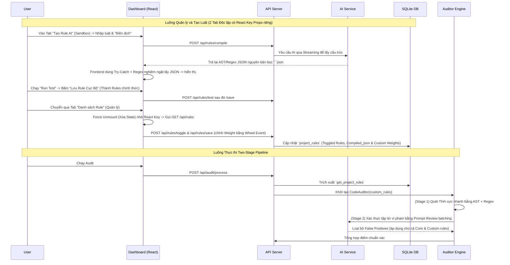

# Kiến trúc Rule Manager & Two-Stage Pipeline
Kiến trúc này mô tả luồng hoạt động của Hệ thống Quản lý Luật và Đường ống Kiểm toán Hai Giai Đoạn (Two-Stage Audit Pipeline).

## 1. Cấu trúc tổng thể (Data Flow)

## 2. API & Data Contract
- `Database`: Entity `project_rules` lưu `target_id`, `compiled_json` (chứa array custom rules), và `disabled_core_rules` (array các ID của luật mặc định bị người dùng cấm).
- `VerificationStep`: Module nhận merged rules rà soát toàn cục. Sẽ loại bỏ các luật tĩnh nằm trong danh sách `disabled_core_rules` trước khi chạy.
- `Interactive Sandbox API (/api/rules/test)`: Nhận đoạn mã tạm thời và `compiled_json`, dựng AST parser tức thời trên RAM để mô phỏng hoạt động của luật. Cực kỳ hiệu quả cho việc thử nghiệm.

## 3. ADR (Architecture Decision Record)
- **Problem**: Giao diện tạo luật AI có tỷ lệ báo sai (hallucination) cao; tĩnh không hiểu được ngữ cảnh; luật mặc định đôi khi quá cứng nhắc gây ức chế.
- **Options**: Xây dựng UI Rule Generator (Kéo thả) vs Dùng AI Sinh luật + Sandbox test + Trình Pruning.
- **Decision & Why**: Chọn Dùng AI sinh luật kết hợp Sandbox + AI Pruning ở giai đoạn Audit.
  - Phân tầng thành Two-Stage pipeline cho phép vừa tận dụng AST tĩnh (siêu tốc, ít tốn Cost API) vừa tận dụng Review (linh động ngữ cảnh, loại bỏ báo lỗi nhảm).
  - Phân quyền tắt bật (`disabled_core_rules`) giúp linh động hóa hệ thống cho mọi tệp Developer.
- **Consequences**: Trở thành Engine hoàn thiện, giảm 90% lỗi False Positive, nhưng tăng Cost API giai đoạn Stage-2 (Review). Để khắc chế Cost, Stage 2 sử dụng cơ chế Batching (đóng gói log) thay vì gọi song song từng request.
