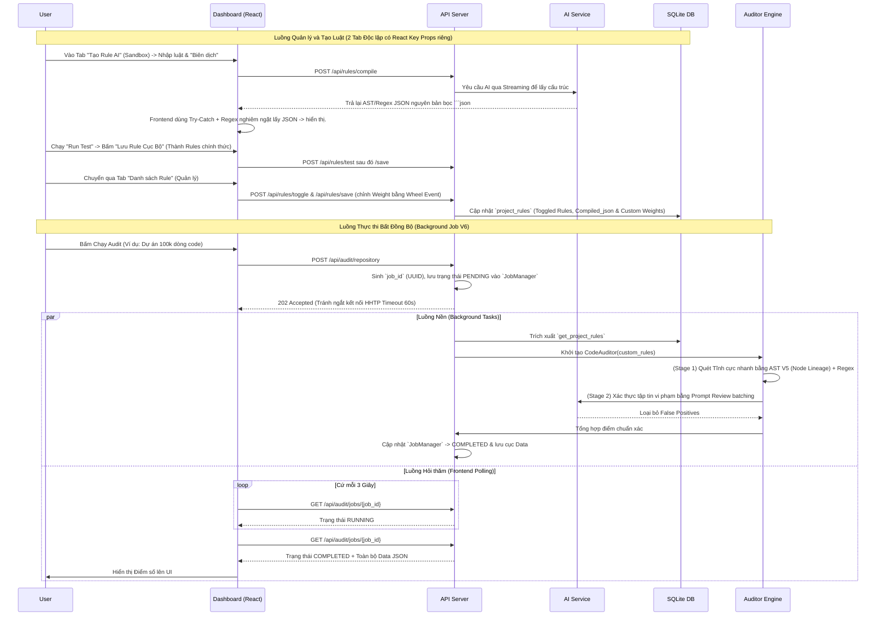

# Kiến trúc Rule Manager & Two-Stage Pipeline
Kiến trúc này mô tả luồng hoạt động của Hệ thống Quản lý Luật và Đường ống Kiểm toán Hai Giai Đoạn (Two-Stage Audit Pipeline).

## 1. Cấu trúc tổng thể (Data Flow)

## 2. API & Data Contract
- `Database`: Entity `project_rules` lưu `target_id`, `compiled_json` (chứa array custom rules), và `disabled_core_rules` (array các ID của luật mặc định bị người dùng cấm).
- `JobManager (V6)`: Quản lý biến trạng thái tiến trình nền. Tách biệt hoàn toàn `logs` và `data` cho từng `job_id`.
- `VerificationStep (V5)`: Bổ sung khả năng lội ngược dòng cấu trúc Cây cú pháp (`parent` node lineage) để bắt lỗi Ngữ nghĩa phức tạp (vd: `with open`). Sẽ loại bỏ các luật tĩnh nằm trong danh sách `disabled_core_rules` trước khi chạy.
- `Interactive Sandbox API (/api/rules/test)`: Nhận đoạn mã tạm thời và `compiled_json`, dựng AST parser tức thời trên RAM để mô phỏng hoạt động của luật. Cực kỳ hiệu quả cho việc thử nghiệm.

## 3. ADR (Architecture Decision Record)
### Quyết định 1: Tạo luật bằng AI + Pruning
- **Problem**: Giao diện tạo luật AI có tỷ lệ báo sai (hallucination) cao; tĩnh không hiểu được ngữ cảnh; luật mặc định đôi khi quá cứng nhắc gây ức chế.
- **Options**: Xây dựng UI Rule Generator (Kéo thả) vs Dùng AI Sinh luật + Sandbox test + Trình Pruning.
- **Decision & Why**: Chọn Dùng AI sinh luật kết hợp Sandbox + AI Pruning ở giai đoạn Audit. Phân tầng thành Two-Stage pipeline.
- **Consequences**: Trở thành Engine hoàn thiện, giảm 90% lỗi False Positive, nhưng tăng Cost API giai đoạn Stage-2.

### Quyết định 2: Chống ngắt kết nối (HTTP Timeout) bằng FastAPI BackgroundTasks (V6)
- **Problem**: API `/audit` chạy đồng bộ. Các siêu dự án (VD: 100k LOC) mất 3-4 phút để AI duyệt. Trình duyệt hoặc Reverse Proxy (Nginx) sẽ cắt đứt mạng ở giây 60 (HTTP 504 Timeout).
- **Options**: Cài Celery + Redis + WebSocket vs Sử dụng `FastAPI BackgroundTasks` + `Long Polling` (Hook React).
- **Decision & Why**: Dùng `BackgroundTasks` kết hợp `JobManager` Pydantic lưu trên RAM. Frontend gọi API qua Hook `useAuditJob` cứ 3 giây 1 lần. Lý do: Giữ cấu trúc ứng dụng Zero-Dependencies (không bắt User cài thêm Redis, tốn tài nguyên), vừa đủ mạnh cho Dashboard.
- **Consequences**: Trình duyệt miễn nhiễm với lỗi kết nối mạng. Code Frontend giảm bớt được State rác. Nhược điểm: Mất dữ liệu tiến trình nếu Server khởi động lại (Không nghiêm trọng đối với luồng Audit tĩnh).
