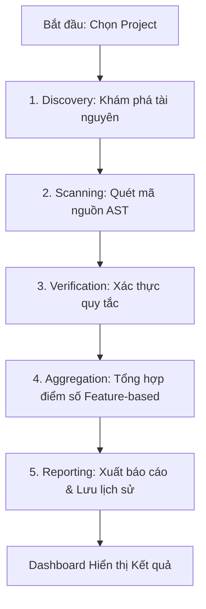

# Architecture Overview

Hệ thống AI Static Analysis (V3) được thiết kế theo mô hình 5 bước kiểm toán tự động, tích hợp giữa Backend (FastAPI), Engine (Auditor) và Frontend (React Dashboard).

## 📊 Quy trình Kiểm toán (5-Step Audit Pipeline)

### 1. Discovery (Khám phá tài nguyên)
Sử dụng `src/engine/discovery.py` để duyệt thư mục, tính toán LOC (Lines of Code) và phân loại các file vào các "Tính năng" (Features) dựa trên cấu trúc thư mục cấp 1.

### 2-3. Scanning & Verification (Quét & Xác thực)
Đây là giai đoạn cốt lõi sử dụng `src/engine/auditor.py` và `src/engine/verification.py`. Hệ thống phân tích cú pháp mã nguồn, tìm kiếm các vi phạm về:
- **Syntax**: Lỗi cú pháp cơ bản.
- **Complexity**: Độ phức tạp Cyclomatic.
- **Security**: Các lỗ hổng tiềm tàng.
- **Documentation**: Sự thiếu hụt comment/docstring.

### 4. Aggregation (Tổng hợp)
Dữ liệu từ các "Trụ cột" (Pillars) được tổng hợp lại thành điểm số cho từng Feature, sau đó tính trung bình để ra điểm tổng thể của dự án (Project Score).

### 5. Reporting (Báo cáo)
Kết quả được lưu vào SQLite (`auditor_v2.db`) và xuất ra các file Markdown trong thư mục `reports/`.

## 🛠️ Infrastructure & Tech Stack

- **Backend**: FastAPI (Python 3.12).
- **Frontend**: React + Vite (Dashboard).
- **Communication**: RESTful API + CORS/PNA Support.
- **Persistence**: SQLite (Audit records).
- **Documentation**: MkDocs (Material Theme).
- **Deployment**: Docker Compose.

---
*Mọi thay đổi kiến trúc lớn phải được ghi nhận trong [Architecture Decision Records (ADR)](design_decisions.md).*
