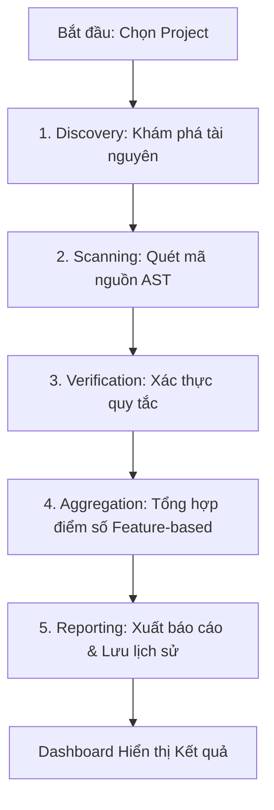
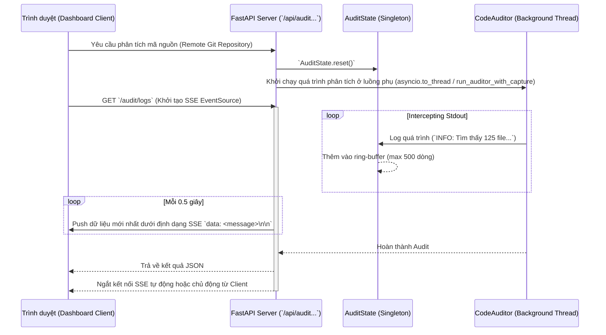

# Architecture Overview

Hệ thống AI Static Analysis (V1.0.0) được thiết kế theo mô hình 5 bước kiểm toán tự động, tích hợp giữa Backend (FastAPI), Engine (Auditor) và Frontend (React Dashboard).

## 📊 Quy trình Kiểm toán (5-Step Audit Pipeline)

### Chi tiết Quy trình Kiểm toán (Pipeline)

Quy trình hoạt động cốt lõi của **Auditor Engine** bao gồm 5 bước cụ thể từ Discovery (Khám phá Code) đến việc kết hợp AI (Two-pass Verification) để sàng lọc vi phạm.

> 🔗 **Đọc thêm:** Tham khảo chi tiết toàn bộ cơ chế tại tài liệu [Core Auditor Engine](../features/core_auditor_engine.md).

## 🛠️ Infrastructure & Tech Stack

- **Backend**: FastAPI (Python 3.12).
- **Frontend**: React + Vite (Dashboard).
- **Communication**: RESTful API + CORS/PNA Support.
- **Persistence**: PostgreSQL (Audit records).
- **Documentation**: MkDocs (Material Theme).
- **Deployment**: Docker Compose.

## 🚀 Kiến trúc Mở rộng (Extended Systems)

### 1. Luồng dữ liệu (Data Flow) - Streaming & Logging Thời gian thực

Để cung cấp phản hồi lập tức (real-time feedback) khi đang quét mã nguồn, hệ thống sử dụng **Server-Sent Events (SSE)**. Quá trình này được quản lý bởi `AuditState`.

**Interface / Contract:**
- **Server:** Chuyển hướng `sys.stdout` thông qua Custom Logger. `AuditState` sẽ đảm bảo đồng bộ hóa luồng sự kiện giữa quá trình chạy ẩn và API Response.
- **Client:** Kết nối `EventSource` tới endpoint `/audit/logs` và tiêu thụ message thông qua `onmessage`.

### 2. Luồng dữ liệu (Data Flow) - Đánh giá AI (AI Review)

Nhằm xóa bỏ các Lập luận False Positive thường gặp ở bộ quét AST, hệ thống tích hợp API LLM để thực hiện kiểm chứng chéo (Two-Pass Audit).

> 🔗 **Đọc thêm:** Sơ đồ luồng dữ liệu (Data Flow) và cách AI gác cổng được trình bày toàn vẹn ở tài liệu [Core Auditor Engine](../features/core_auditor_engine.md).

---
*Mọi thay đổi kiến trúc lớn phải được ghi nhận trong [Architecture Decision Records (ADR)](design_decisions.md).*
