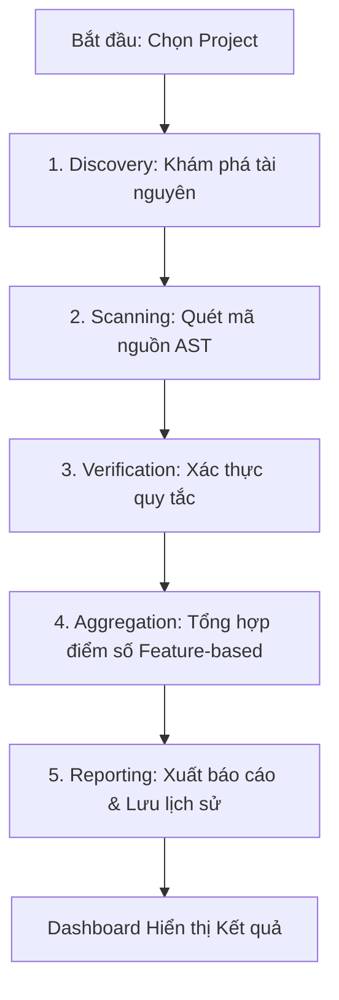
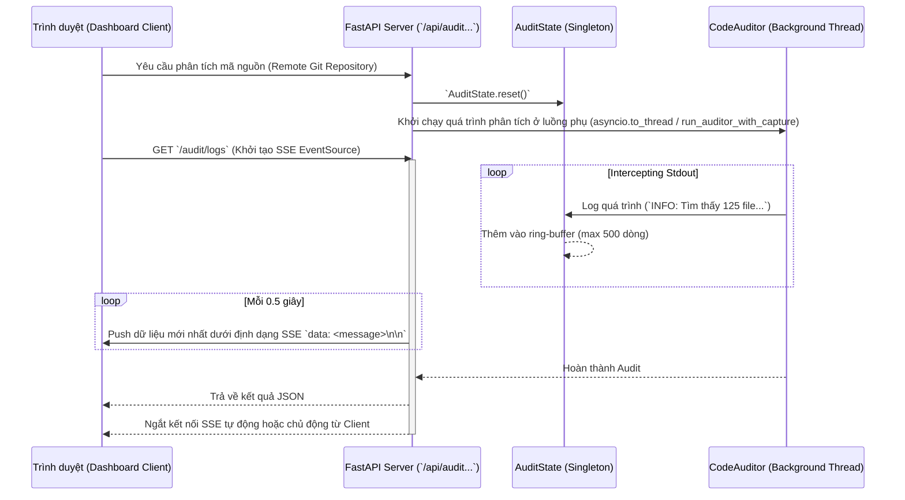
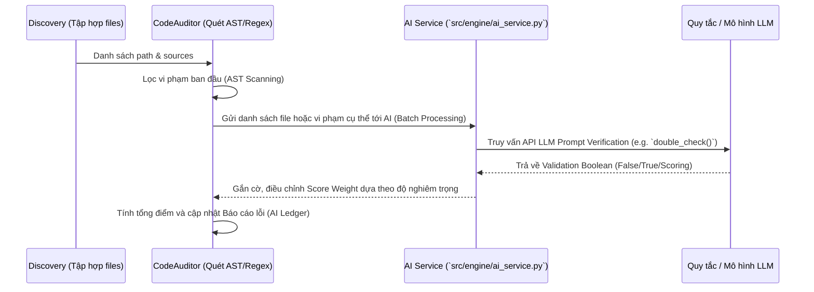

# Architecture Overview

Hệ thống AI Static Analysis (V1.0.0) được thiết kế theo mô hình 5 bước kiểm toán tự động, tích hợp giữa Backend (FastAPI), Engine (Auditor) và Frontend (React Dashboard).

## 📊 Quy trình Kiểm toán (5-Step Audit Pipeline)

### 1. Discovery (Khám phá tài nguyên)
Sử dụng `src/engine/discovery.py` để duyệt thư mục, tính toán LOC (Lines of Code) và phân loại các file vào các "Tính năng" (Features) dựa trên cấu trúc thư mục cấp 1.

### 2-3. Scanning & Verification (Quét & Xác thực)
Đây là giai đoạn cốt lõi sử dụng `src/engine/auditor.py` và `src/engine/verification.py`. Hệ thống sử dụng **Rule Engine** (cấu hình tại `src/engine/rules.json`) để thực hiện các kiểm tra:
- **Syntax**: Lỗi cú pháp cơ bản.
- **Complexity**: Độ phức tạp Cyclomatic (được tính toán bằng AST).
- **Security**: Các lỗ hổng tiềm tàng, hardcoded secrets, và các hàm nguy hiểm (`eval`, `exec`).
- **Documentation**: Sự thiếu hụt comment/docstring.

### 4. Aggregation (Tổng hợp)
Dữ liệu từ các "Trụ cột" (Pillars) được tổng hợp lại thành điểm số cho từng Feature, sau đó tính trung bình để ra điểm tổng thể của dự án (Project Score).

### 5. Reporting (Báo cáo)
Kết quả được lưu vào SQLite (`auditor_v2.db`) và xuất ra các file Markdown trong thư mục `reports/`.

## 🛠️ Infrastructure & Tech Stack

- **Backend**: FastAPI (Python 3.12).
- **Frontend**: React + Vite (Dashboard).
- **Communication**: RESTful API + CORS/PNA Support.
- **Persistence**: SQLite (Audit records).
- **Documentation**: MkDocs (Material Theme).
- **Deployment**: Docker Compose.

## 🚀 Kiến trúc Mở rộng (Extended Systems)

### 1. Luồng dữ liệu (Data Flow) - Streaming & Logging Thời gian thực

Để cung cấp phản hồi lập tức (real-time feedback) khi đang quét mã nguồn, hệ thống sử dụng **Server-Sent Events (SSE)**. Quá trình này được quản lý bởi `AuditState`.

**Interface / Contract:**
- **Server:** Chuyển hướng `sys.stdout` thông qua Custom Logger. `AuditState` sẽ đảm bảo đồng bộ hóa luồng sự kiện giữa quá trình chạy ẩn và API Response.
- **Client:** Kết nối `EventSource` tới endpoint `/audit/logs` và tiêu thụ message thông qua `onmessage`.

### 2. Luồng dữ liệu (Data Flow) - AI Code Review

Quá trình quét tĩnh (Static Analysis) thông thường dựa vào cây cú pháp AST hoặc biểu thức chính quy Regex, nhưng tính năng xác thực AI (AI Service) được triển khai qua API bên ngoài (ví dụ OpenAI) để giảm False Positives hoặc kiểm tra Logic ở mức cao.

**Interface / Contract:**
- **CodeAuditor:** Chuẩn bị sẵn dữ liệu thô (Raw violations or File AST).
- **AI Service:** Batch request qua mạng tốn chi phí và thời gian, do đó quy trình được thiết kế ở dạng `Deep Scan` (tùy chọn) thay vì quét đồng bộ.

---
*Mọi thay đổi kiến trúc lớn phải được ghi nhận trong [Architecture Decision Records (ADR)](design_decisions.md).*
