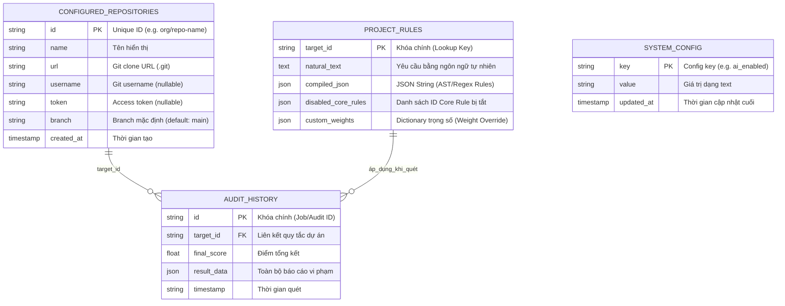

# Database - Tổng quan

Hệ thống sử dụng **PostgreSQL** làm cơ sở dữ liệu chính để lưu trữ lịch sử kiểm toán. PostgreSQL được lựa chọn (thay thế SQLite) nhờ khả năng xử lý đa luồng (Concurrency), loại bỏ hoàn toàn hiện tượng File Lock khi chạy Audit song song, và chuẩn bị cho các nâng cấp Vector Database sau này.

## Kiến trúc Dữ liệu
Dữ liệu được tổ chức theo mô hình quan hệ cơ bản kèm JSON payload để tối ưu hóa tốc độ truy xuất. Mọi thông tin chi tiết về điểm số (Scoring) được đóng gói dưới dạng JSON.

## Vị trí lưu trữ
Trong môi trường Docker Compose: Service `db` chạy ở cổng `:5432` nội bộ.
Dữ liệu thực tế được ánh xạ qua Docker Volume: `pgdata:/var/lib/postgresql/data`

> [!NOTE]
> Từ bản V4, thông tin kết nối DB được quản lý qua biến môi trường trong `.env` (không hardcode trong `docker-compose.yml`).

## Các cấu trúc bảng (Schema)

Hệ thống hiện tại lưu trữ 4 bảng chính. Dưới đây là Sơ đồ quan hệ thực thể (ER Diagram):

### 1. Bảng `configured_repositories` (MỚI)
Lưu trữ danh sách các Git repository được cấu hình để audit. Thay thế `CONFIGURED_REPOSITORIES` hardcoded trong `config.py`.
- `id` (TEXT PRIMARY KEY) — Unique identifier (e.g. `longkunno-check-project`).
- `name` (TEXT NOT NULL) — Tên hiển thị trên Dashboard.
- `url` (TEXT NOT NULL) — Git clone URL.
- `username` (TEXT) — Git username (nullable, dùng cho private repos).
- `token` (TEXT) — Access token (nullable, **không** trả về qua API).
- `branch` (TEXT DEFAULT 'main') — Branch mặc định.
- `created_at` (TIMESTAMP) — Thời gian tạo bản ghi.

> [!IMPORTANT]
> Auto-seed: Lần khởi chạy đầu tiên, hệ thống tự động import dữ liệu từ `config.py` (deprecated) vào bảng này nếu bảng trống. Xem `AuditDatabase.seed_default_repositories()`.

### 2. Bảng `audit_history`
Lưu trữ lịch sử tất cả các phiên kiểm toán thành công (Bao gồm file diff, logs lỗi, và metadata phiên quét).
- `id` (SERIAL PRIMARY KEY) - Khóa chính.
- `timestamp` (TIMESTAMP) - Thời gian quét mặc định tĩnh.
- `total_loc` (INTEGER), `violations_count` (INTEGER), `score` (REAL) - Các chỉ số điểm.
- `pillar_scores`, `full_json` (TEXT JSON) - Dữ liệu payload chi tiết.

### 3. Bảng `project_rules`
Lưu trữ các luật cấu hình được người dùng chỉ định qua tính năng Ngôn ngữ tự nhiên. 
- `id` (SERIAL PRIMARY KEY)
- `target_id` (TEXT) - Unique lookup key.
- `natural_text` (TEXT) - Yêu cầu bằng ngôn ngữ tự nhiên.
- `compiled_json` (TEXT) - Lưu trữ dưới dạng JSON string.
- `disabled_core_rules` (TEXT) - JSON Array lưu danh sách ID Core Rule bị tắt.
- `custom_weights` (TEXT) - JSON Dictionary lưu trữ trọng số (Weight Override) của từng luật cụ thể.

### 4. Bảng `system_config` (MỚI — V5)
Key-value store để lưu cấu hình engine runtime, thay đổi từ Settings UI mà không cần restart container.
- `key` (VARCHAR(64) PRIMARY KEY) — Tên config (e.g. `ai_enabled`, `ai_max_concurrency`, `test_mode_limit_files`).
- `value` (TEXT NOT NULL) — Giá trị dạng text (parse theo context: bool, int, string).
- `updated_at` (TIMESTAMP) — Thời điểm cập nhật cuối.

**Keys hiện tại:**

| Key | Kiểu | Mặc định | Mô tả |
|-----|------|----------|-------|
| `ai_enabled` | bool string | `"false"` (.env) | Bật/tắt AI-Powered Analysis |
| `ai_max_concurrency` | int string | `"5"` (.env) | Giới hạn số request AI chạy song song cho Validation + Deep Audit |
| `test_mode_limit_files` | int string | `"0"` (.env) | 0 = full scan, >0 = giới hạn N files |

> [!NOTE]
> Ưu tiên đọc: DB → .env (fallback). Helper functions: `get_ai_enabled()`, `get_ai_max_concurrency()`, `get_test_mode_limit()` trong `config.py`.

## API CRUD cho Repository Management

| Method | Endpoint | Mô tả |
|--------|----------|-------|
| GET | `/api/repositories` | Lấy danh sách repos (ẩn token) |
| POST | `/api/repositories` | Thêm repository mới |
| PUT | `/api/repositories/{id}` | Cập nhật repository |
| DELETE | `/api/repositories/{id}` | Xóa repository |
| GET | `/api/repositories/scores` | Lấy danh sách repos kèm điểm audit mới nhất |

## API Engine Settings

| Method | Endpoint | Mô tả |
|--------|----------|-------|
| GET | `/api/settings/engine` | Lấy cấu hình engine hiện tại (DB → .env fallback) |
| PUT | `/api/settings/engine` | Cập nhật cấu hình engine (lưu DB, runtime reload) |

---
*Duy trì bởi LongDD.*
