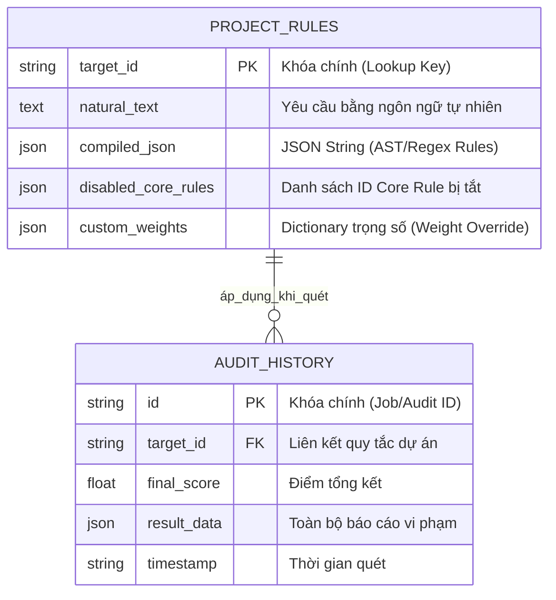

# Database - Tổng quan

Hệ thống sử dụng **SQLite** làm cơ sở dữ liệu chính để lưu trữ lịch sử kiểm toán. SQLite được lựa chọn nhờ tính gọn nhẹ, không yêu cầu server riêng biệt và phù hợp với mô hình chạy trong container.

## Kiến trúc Dữ liệu
Dữ liệu được tổ chức theo mô hình thiết kế phẳng (Flat architecture) để tối ưu hóa tốc độ truy xuất. Mọi thông tin chi tiết về điểm số (Scoring) được đóng gói dưới dạng JSON.

## Vị trí lưu trữ
Trong môi trường Docker: `/app/auditor_v2.db`
Trên máy Host: `./auditor_v2.db`

## Các cấu trúc bảng (Schema) mới

Hệ thống hiện tại lưu trữ 2 bảng chính đóng vai trò nòng cốt. Dưới đây là Sơ đồ quan hệ thực thể (ER Diagram) minh họa trúc dữ liệu:

### 1. Bảng `audit_history`
Lưu trữ lịch sử tất cả các phiên kiểm toán thành công (Bao gồm file diff, logs lỗi, và metadata phiên quét).

### 2. Bảng `project_rules`
Lưu trữ các luật cấu hình được người dùng chỉ định qua tính năng Ngôn ngữ tự nhiên. 
- `target_id` (TEXT) - Primary lookup key.
- `natural_text` (TEXT) - Yêu cầu bằng ngôn ngữ tự nhiên.
- `compiled_json` (TEXT) - Lưu trữ dưới dạng JSON string.
- `disabled_core_rules` (TEXT) - JSON Array lưu danh sách ID Core Rule bị tắt.
- `custom_weights` (TEXT) - JSON Dictionary lưu trữ trọng số (Weight Override) của từng luật cụ thể.

---
*Duy trì bởi LongDD.*
