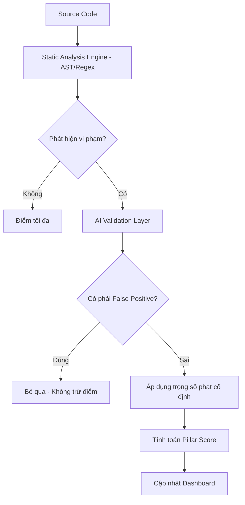

# AI-Assisted Code Review

Tính năng này tích hợp trí tuệ nhân tạo (AI) để nâng cao độ chính xác của Static Analysis hiện có, giúp phát hiện các lỗi logic phức tạp mà AST/Regex khó nhận diện.

## Luồng hoạt động (Data Flow)

## Các phương án đảm bảo ổn định (Stability Strategies)

Hệ thống áp dụng các chiến thuật sau để tránh hiện tượng "điểm số biến động":

| Chiến thuật | Cách thực hiện | Lợi ích |
| :--- | :--- | :--- |
| **Deterministic Rubric** | AI chỉ gán nhãn lỗi vào các Category có sẵn | Điểm số được tính bằng công thức toán học, không phải cảm tính của AI. |
| **Few-shot Anchoring** | Cung cấp mẫu "Code - Lỗi - Giải thích" trong Prompt | Giúp AI duy trì tiêu chuẩn đánh giá nhất quán qua các lần quét. |
| **JSON Enforcement** | Ép kiểu output AI bằng Schema | Đảm bảo hệ thống backend luôn nhận được dữ liệu cấu trúc đúng định dạng. |
| **Confidence Threshold** | Chỉ trừ điểm nếu độ tự tin của AI > 85% | Tránh việc trừ điểm nhầm do AI "đoán mò". |

## Quy tắc thiết kế (Design Rules)

1. **AI không nắm quyền sinh sát**: Điểm số cuối cùng phải luôn có thể giải thích được bằng các quy tắc (Rules) cụ thể.
2. **Minh bạch (Transparency)**: Trong báo cáo, phần nào do AI thẩm định phải được đánh dấu rõ ràng (AI-Verified).
3. **Fallback**: Nếu AI gặp sự cố (Network/API), hệ thống tự động quay về chế độ Static Analysis thuần túy để không làm gián đoạn CI/CD.

## Edge Cases & Gotchas (Xử lý ngoại lệ)

- **AI Tool Calls Fallback**: Trong một số quá trình xử lý, mô hình AI có thể trả về kết quả dưới dạng `tool_calls` thay vì `content` trực tiếp do tự động gọi tool format JSON. Hệ thống đã xử lý linh hoạt việc trích xuất JSON từ `tool_calls[0].function.arguments` để đảm bảo luôn thu được dữ liệu kết quả phân tích.
- **Batch Size & Concurrency Optimization**: Kích thước batch khi xác thực vi phạm được giữ ở mức `5` lỗi/request để đảm bảo AI phân tích chính xác. Tuy nhiên, để tối ưu hóa tài nguyên và tránh lỗi **502 Bad Gateway** khi gửi request ồ ạt ban đầu, hệ thống áp dụng cơ chế **Staggered Concurrency**: giới hạn `25` luồng đồng thời kết hợp với độ trễ tăng dần (`asyncio.sleep`) tỷ lệ thuận với số lượng chunk. Điều này giúp dải tần request được mượt mà hơn, vượt qua các rào cản rate-limit và đảm bảo độ ổn định cao nhất cho quá trình kiểm toán.

---
*Duy trì bởi LongDD.*
