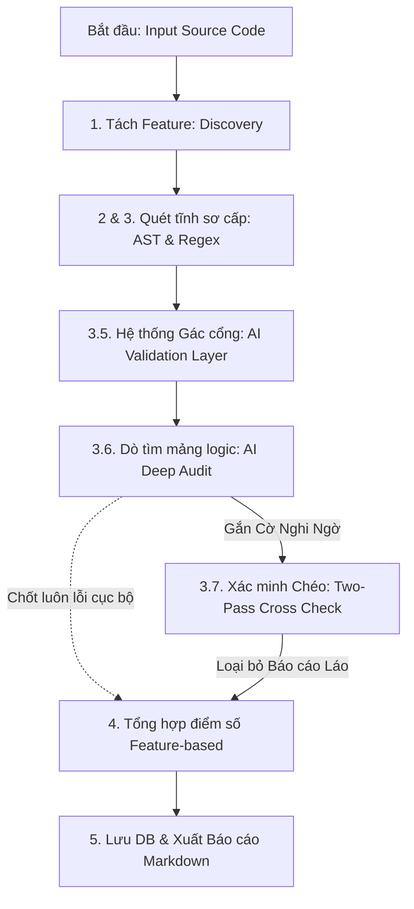
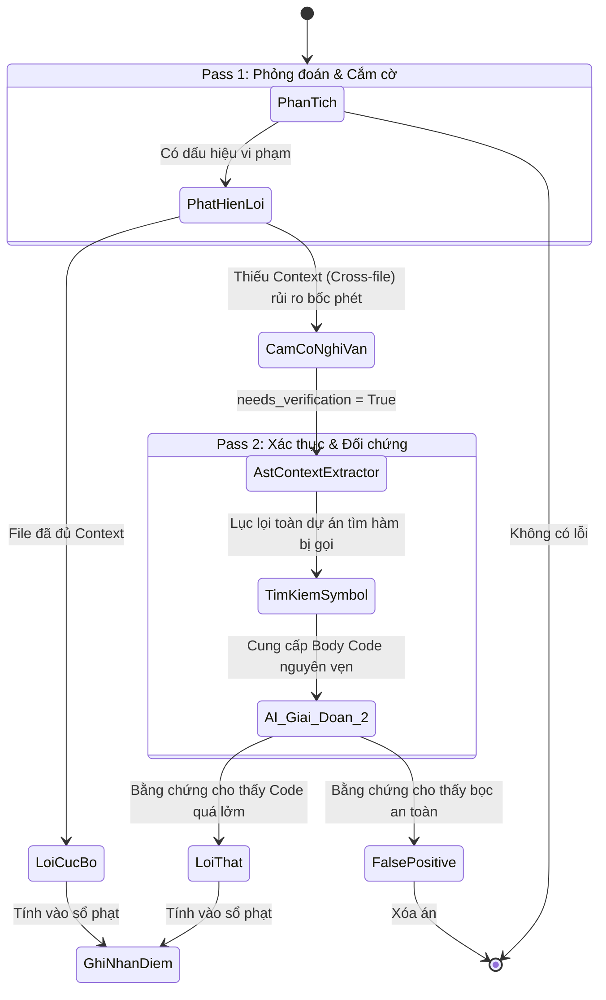

# Bộ máy Kiểm toán Cốt lõi (Core Auditor Engine)

Đây là trung tâm xử lý, thực hiện việc quét và phát hiện các vi phạm quy chuẩn chất lượng dựa trên sự kết hợp giữa Phân tích Tĩnh (Static Analysis) và Phân tích LLM. Quá trình này được thiết kế theo một **Quy trình 5 Bước (5-Step Audit Pipeline)** để đảm bảo độ chính xác, hiệu năng và tránh tối đa hiện tượng Báo cáo giả (False Positives).

## 🚀 Đường ống Đánh giá 5 Bước (Data Flow)

Toàn bộ quy trình diễn ra xuyên suốt theo thứ tự:  
**Discovery tĩnh** $\rightarrow$ **Static Regex/AST** $\rightarrow$ **AI Gác cổng** $\rightarrow$ **AI Reasoning (Two-Pass)** $\rightarrow$ **Tính điểm phân cực**.

## Các Bước Triển Khai Chi Tiết

### 1. Khám phá Tài nguyên (Discovery)
- **Cách hoạt động:** Điểm bắt đầu tại `src/engine/discovery.py`. Hệ thống đếm LOC (Lines of Code) và lập bản đồ các File theo Tính năng (Feature). Nó ưu tiên ánh xạ các thư mục logic nghiệp vụ thay vì quét mù quáng các file tĩnh không logic (CSS/HTML).
- **Auto-detect Source Root:** Engine tự động tìm thư mục source theo danh sách ưu tiên: `source_code` → `code` → `src` → `app` → `backend` → `api` → `growme_app` → `growme_api`. Khi phát hiện thư mục khớp, engine đào sâu vào bên trong và các **subdirectory cấp 1** trở thành các Feature/Module riêng biệt (thay vì gom thành 1 module duy nhất).
- **Tối ưu Mode Test:** Có chế độ giới hạn số file khi chạy kiểm thử để tiết kiệm Token LLM (giới hạn `TEST_MODE_LIMIT_FILES`).
- **Bật/Tắt AI:** Biến môi trường `AI_ENABLED` (mặc định `true`) cho phép tắt toàn bộ 3 bước AI (3.5, 3.6, 3.7). Khi `AI_ENABLED=false`, hệ thống chỉ chạy Static Analysis (Regex + AST) — phù hợp khi không có API key hoặc cần audit nhanh không tốn token.

### 2. Quét Tĩnh Cú pháp (Static Scanning & Verification)
- Kết hợp **Modular Scanners** khắt khe nhưng nhẹ nhàng cho CPU.
- `PythonASTScanner`: Đọc cây Cú pháp Python thuần túy. Tính toán Cyclomatic Complexity, Length của hàm, phát hiện N+1 Query vòng lặp, Bare Excepts. Xây dựng "Bản đồ đường đi Import" sơ khai nhằm chẩn đoán chứng Lỗi phân nhánh vòng tròn (Circular Dependency).
- `RegexScanner`: Tìm kiếm siêu nhanh các đoạn Hardcode password hoặc các quy ước cấu trúc tự do.
*Output bước này: Danh sách lỗi thô (Raw Violations).*

#### Bug Fixes (2026-04-03)

**Engine Rule Fixes (giảm False Positive):**
- **UNUSED_IMPORT Dotted Import:** Bổ sung **Attribute chain tracking** cho dotted imports (`urllib.parse`, `starlette.formparsers`). Tham chiếu: `src/engine/scanners.py`.
- **MUTATING_COLLECTION_ITERATION:** Xóa Regex thô, chuyển sang **AI-only detection** với prompt yêu cầu bằng chứng mutation.
- **PRINT_STATEMENT:** Skip test files (`tests/`, `test_*.py`) + `__main__` guard.
- **SQL_INJECTION:** Regex chỉ match `f-string` và `.format()`, không bắt parameterized queries.
- **SLOW_STRING_CONCAT:** Chuyển sang AI-only, không bắt `integer += 1`.
- **dangerous_functions ghi đè:** Fix bug chỉ giữ 1 rule `dangerous_functions` → **hỗ trợ nhiều rules** cùng type (eval + print cùng tồn tại).
- **Regex compile caching:** Thêm `_pattern_cache` class-level tránh recompile pattern cho mỗi file.
- **Bổ sung PEP8 / Clean Code Rules:** Thêm nhóm quy tắc làm sạch mã gồm: `PEP8_WILDCARD_IMPORT`, `PEP8_NAMING_CONVENTION`, `PEP8_TAB_INDENTATION`, `SHADOWING_BUILTINS`, `COMPLEX_COMPREHENSION`, `PEP8_LAMBDA_ASSIGNMENT`, `PEP8_BAD_NEGATIVE_KEYWORD`, `PEP8_AMBIGUOUS_VARIABLE_NAME`, `PEP8_ISINSTANCE_OVER_TYPE`, `PEP8_MODULE_LEVEL_IMPORTS`, `PEP8_STRING_SLICING_PREFIX`, và `PEP8_CONSISTENT_RETURNS`. Đồng thời bổ sung 4 lỗi cảnh báo (Python Gotchas): `FLOAT_EQUALITY_DANGER`, `NAIVE_DATETIME`, `F_STRING_MISUSE`, `REDUNDANT_DICT_GET` để tối ưu toàn diện chất lượng dự án.

**Code Quality Fixes:**
- `database.py`: Xóa hardcoded password, thêm `SELECT...FOR UPDATE` cho toggle_core_rule.
- `api_server.py`: Xóa `asyncio` unused, CORS→env, DoS 100K→10K, validation handler không leak body.
- `audit_state.py`: `cleanup_old_jobs()` thread-safe, rename `get_active_job` → `get_active_job_id`.
- `scoring.py`: Fix docstring misleading 0-10 vs 0-100, `.get('final', 0)` KeyError.
- `auditor.py`: Safe `float()` cho AI weight, `asyncio.new_event_loop()` thay `get_event_loop()`.
- `verification.py`: Log SyntaxError, safe `float()` cho custom weights.
- `symbol_indexer.py`: Thông minh hóa fallback `end_lineno` dựa trên body.
- `dependency_checker.py`: Dùng path-based module name tránh collision.
- `config.py`: `try/except` cho `int()` env parsing.
- `tests/`: Fix string concat trong loop, None guard cho DB result.

### 3. Lớp Gác cổng AI (AI Hybrid Validation)
- Công cụ tĩnh (AST) tuy nhanh nhưng thường đánh giá theo hướng cực đoan dẫn đến dư thừa lỗi ảo (False Positive). Vd: Cứ thấy `eval` là quy tội bảo mật dù nó đã bọc Filter an toàn.
- **Cách hoạt động:** Nhóm các lỗi tìm được thành từng khối rồi ủy quyền cho AI phân định: *"Lỗi Regex/AST này có thực sự là hiểm họa nguy cấp trong bối cảnh khối code thực tế (snippet) hay không?"*
- Nếu AI kết luận Đoạn này an toàn (hoặc có giải pháp bảo vệ bọc ngoài) $\rightarrow$ Cờ `is_false_positive` sẽ lên và lỗi bị xóa bỏ khỏi Sổ tài khoản.

### 4. Đánh giá Logic Chiều Sâu (AI Reasoning & Deep Audit)
Đây là khu vực tìm kiếm các lỗi Kiến trúc vĩ mô, Luồng dữ liệu xuyên biên giới mà Static Analysis chịu chết. Tích hợp kiến trúc **Two-Pass Audit (Cắm cờ & Kiểm chứng chéo)** để xóa nạn ảo giác LLM mà cực kì chắt chiu Token.

- **Pass 1: AI Hypothesize (Cắm cờ - Bước 3.6)**: 
  AI đóng vai trò Người Khởi Xướng (Auditor). Đọc file gốc và vẽ ra các lỗi. Tuy nhiên, nếu bị che mắt (Ví dụ: File này gọi hàm của API File kia, nhìn không thấy ruột hàm đó) $\rightarrow$ Tuyệt đối Không đoán mò! AI nhả cờ hiệu `needs_verification: true` kèm theo Tên hàm để xin hệ thống cung cấp thêm tư liệu (`verify_target`). Lỗi này bị ghim thành **Cờ Nghi Vấn (Flagged)** thay vì đưa vào bảng điểm.
  
- **Pass 2: Double-Check (Kiểm chứng bằng chứng - Bước 3.7)**: 
  Sử dụng Module `AstContextExtractor` bên trong `symbol_indexer.py`. Server tự động bay lùng sục cái "Tên hàm bị nghi vấn" kia qua toàn bộ ngóc ngách của Dự Án, bắt nguyên cái Thân Hàm (Body) mang về. AI (vai trò Verifier) soi kĩ Bằng Chứng.
  Nếu bằng chứng cho thấy hàm kia xử lý Lởm $\rightarrow$ Chốt Lỗi Thật. Nếu hàm viết kỹ $\rightarrow$ Trắng Án.

#### Smart Batching & Token Budget (ADR - 2026-04-02)

**Vấn đề:** Khi audit dự án lớn (ví dụ SP Integrate), 1 batch cố định 5 file có thể tạo prompt lên tới **148K tokens** — vượt giới hạn context window của nhiều model AI.

**Giải pháp:** Hệ thống Smart Batching thay thế batch size cố định bằng cơ chế động. Nội dung file luôn được gửi **nguyên vẹn** (không cắt bớt), chỉ kiểm soát số file/batch:

| Tham số | Giá trị | Mô tả |
|---------|---------|-------|
| `MAX_FILES_PER_BATCH` | 5 | Tối đa 5 file/batch |
| `MAX_CHARS_PER_BATCH` | 210,000 chars (~60K tokens) | Budget tổng cho phần code trong 1 batch |

**Logic:**
1. Duyệt tuần tự qua danh sách file, đo kích thước thực (chars) từ nội dung đọc được.
2. Nếu file đơn lẻ >= budget -> gửi riêng 1 file/batch (nguyên vẹn nội dung).
3. Nếu thêm file vào batch hiện tại vượt budget hoặc đạt 5 files -> flush batch, tạo batch mới.
4. File nhỏ được gom tối đa 5 file/batch để tiết kiệm số lượng request.

**Kết quả:** Tránh tạo prompt khổng lồ 148K tokens. File lớn được gửi riêng, file nhỏ gom nhóm hiệu quả.

**Tham chiếu:** `auditor.py` dòng 155-205

### 5. Khấu trừ Điểm, Chấm Hạng Phân Cấp & Xuất Cáo Cáo (Aggregation & Reporting)
Cuối cùng, các vi phạm đọng lại sau nhiều lần bộ lọc (AI) sẽ tiến vào Máy đo lường Điểm Số:
- **Tính điểm Phân cấp (Feature-based Scoring):** Quy đổi thành Điểm Số cho Từng Tính Năng để xem khu vực nào Nợ lớn nhất (Technical Debt). Tích hợp cấu trúc Phạt Nặng/Nhẹ.
- **Truy vấn Authorship:** Kiểm toán lại Member Tác quyền nào viết ra Lỗi đó (Tối đa 3 Tháng - The 3 Month Blame limit) để quy trách nhiệm hiệu suất cá nhân.
- **Audit Mode Tracking:** Ghi nhận lại chế độ quét (`scan_mode`) là `full_ai` (đầy đủ các bước kiểm tra mạnh mẽ nhất) hay `static_only` (chỉ dùng các công cụ tĩnh, tắt AI) vào trong Audit History. Điều này giúp hệ thống/dashboard đối chiếu minh bạch các phiên bản quét với nhau nhằm giải thích sự chênh lệch (nếu có) về số lượng lỗi.
- **Xuất Báo cáo (Reporting):** Hệ thống tự động tạo báo cáo Markdown (`reports/Final_Audit_Report.md`) với các thành phần thống kê Nâng Cao:
  - **Phân bổ Mức độ Nghiêm trọng (Severity Distribution):** Liệt kê thống kê số lượng lỗi phân loại theo `Blocker`, `Critical`, `Major`, `Minor`, `Info` để nhanh chóng khoanh vùng mức độ nguy hiểm của toàn cục dự án.
  - **Thống kê Theo Luật (Rule Breakdown):** Xác định tần suất và tổng mức phạt của từng Unit Rule (Rule ID) giúp team nhận biết những lỗi sai logic nào team đang mắc phải nhiều nhất để đưa vào quy chuẩn đào tạo.

---
*Duy trì bởi Tech Lead.*
