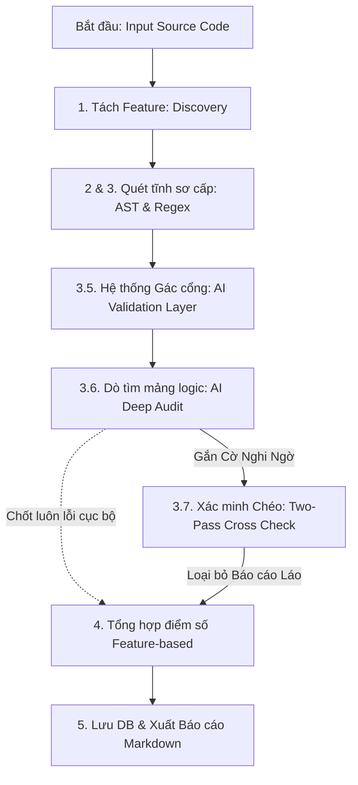
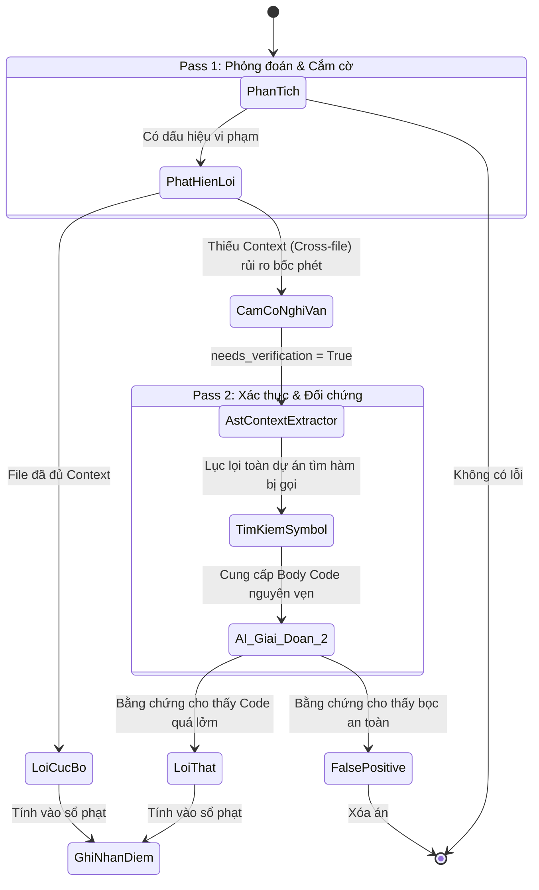

# Bộ máy Kiểm toán Cốt lõi (Core Auditor Engine)

Đây là trung tâm xử lý, thực hiện việc quét và phát hiện các vi phạm quy chuẩn chất lượng dựa trên sự kết hợp giữa Phân tích Tĩnh (Static Analysis) và Phân tích LLM. Quá trình này được thiết kế theo một **Quy trình 5 Bước (5-Step Audit Pipeline)** để đảm bảo độ chính xác, hiệu năng và tránh tối đa hiện tượng Báo cáo giả (False Positives).

## 🚀 Đường ống Đánh giá 5 Bước (Data Flow)

Toàn bộ quy trình diễn ra xuyên suốt theo thứ tự:  
**Discovery tĩnh** $\rightarrow$ **Static Regex/AST** $\rightarrow$ **AI Gác cổng** $\rightarrow$ **AI Reasoning (Two-Pass)** $\rightarrow$ **Tính điểm phân cực**.

## Các Bước Triển Khai Chi Tiết

### 1. Khám phá Tài nguyên (Discovery)
- **Cách hoạt động:** Điểm bắt đầu tại `src/engine/discovery.py`. Hệ thống đếm LOC (Lines of Code) và lập bản đồ các File theo Tính năng (Feature). Nó ưu tiên ánh xạ các thư mục logic nghiệp vụ thay vì quét mù quáng các file tĩnh không logic (CSS/HTML).
- **Tối ưu Mode Test:** Có chế độ giới hạn số file khi chạy kiểm thử để tiết kiệm Token LLM (giới hạn `TEST_MODE_LIMIT_FILES`).

### 2. Quét Tĩnh Cú pháp (Static Scanning & Verification)
- Kết hợp **Modular Scanners** khắt khe nhưng nhẹ nhàng cho CPU.
- `PythonASTScanner`: Đọc cây Cú pháp Python thuần túy. Tính toán Cyclomatic Complexity, Length của hàm, phát hiện N+1 Query vòng lặp, Bare Excepts. Xây dựng "Bản đồ đường đi Import" sơ khai nhằm chẩn đoán chứng Lỗi phân nhánh vòng tròn (Circular Dependency).
- `RegexScanner`: Tìm kiếm siêu nhanh các đoạn Hardcode password hoặc các quy ước cấu trúc tự do.
*Output bước này: Danh sách lỗi thô (Raw Violations).*

### 3. Lớp Gác cổng AI (AI Hybrid Validation)
- Công cụ tĩnh (AST) tuy nhanh nhưng thường đánh giá theo hướng cực đoan dẫn đến dư thừa lỗi ảo (False Positive). Vd: Cứ thấy `eval` là quy tội bảo mật dù nó đã bọc Filter an toàn.
- **Cách hoạt động:** Nhóm các lỗi tìm được thành từng khối rồi ủy quyền cho AI phân định: *"Lỗi Regex/AST này có thực sự là hiểm họa nguy cấp trong bối cảnh khối code thực tế (snippet) hay không?"*
- Nếu AI kết luận Đoạn này an toàn (hoặc có giải pháp bảo vệ bọc ngoài) $\rightarrow$ Cờ `is_false_positive` sẽ lên và lỗi bị xóa bỏ khỏi Sổ tài khoản.

### 4. Đánh giá Logic Chiều Sâu (AI Reasoning & Deep Audit)
Đây là khu vực tìm kiếm các lỗi Kiến trúc vĩ mô, Luồng dữ liệu xuyên biên giới mà Static Analysis chịu chết. Tích hợp kiến trúc **Two-Pass Audit (Cắm cờ & Kiểm chứng chéo)** để xóa nạn ảo giác LLM mà cực kì chắt chiu Token.

- **Pass 1: AI Hypothesize (Cắm cờ - Bước 3.6)**: 
  AI đóng vai trò Người Khởi Xướng (Auditor). Đọc file gốc và vẽ ra các lỗi. Tuy nhiên, nếu bị che mắt (Ví dụ: File này gọi hàm của API File kia, nhìn không thấy ruột hàm đó) $\rightarrow$ Tuyệt đối Không đoán mò! AI nhả cờ hiệu `needs_verification: true` kèm theo Tên hàm để xin hệ thống cung cấp thêm tư liệu (`verify_target`). Lỗi này bị ghim thành **Cờ Nghi Vấn (Flagged)** thay vì đưa vào bảng điểm.
  
- **Pass 2: Double-Check (Kiểm chứng bằng chứng - Bước 3.7)**: 
  Sử dụng Module `AstContextExtractor` bên trong `symbol_indexer.py`. Server tự động bay lùng sục cái "Tên hàm bị nghi vấn" kia qua toàn bộ ngóc ngách của Dự Án, bắt nguyên cái Thân Hàm (Body) mang về. AI (vai trò Verifier) soi kĩ Bằng Chứng.
  Nếu bằng chứng cho thấy hàm kia xử lý Lởm $\rightarrow$ Chốt Lỗi Thật. Nếu hàm viết kỹ $\rightarrow$ Trắng Án.

### 5. Khấu trừ Điểm, Chấm Hạng Phân Cấp & Xuất Cáo Cáo (Aggregation & Reporting)
Cuối cùng, các vi phạm đọng lại sau nhiều lần bộ lọc (AI) sẽ tiến vào Máy đo lường Điểm Số:
- **Tính điểm Phân cấp (Feature-based Scoring):** Quy đổi thành Điểm Số cho Từng Tính Năng để xem khu vực nào Nợ lớn nhất (Technical Debt). Tích hợp cấu trúc Phạt Nặng/Nhẹ.
- **Truy vấn Authorship:** Kiểm toán lại Member Tác quyền nào viết ra Lỗi đó (Tối đa 6 Tháng - The 6 Month Blame limit) để quy trách nhiệm hiệu suất cá nhân.
- **Xuất Báo cáo (Reporting):** Hệ thống tự động tạo báo cáo Markdown (`reports/Final_Audit_Report.md`) với các thành phần thống kê Nâng Cao:
  - **Phân bổ Mức độ Nghiêm trọng (Severity Distribution):** Liệt kê thống kê số lượng lỗi phân loại theo `Blocker`, `Critical`, `Major`, `Minor`, `Info` để nhanh chóng khoanh vùng mức độ nguy hiểm của toàn cục dự án.
  - **Thống kê Theo Luật (Rule Breakdown):** Xác định tần suất và tổng mức phạt của từng Unit Rule (Rule ID) giúp team nhận biết những lỗi sai logic nào team đang mắc phải nhiều nhất để đưa vào quy chuẩn đào tạo.

---
*Duy trì bởi Tech Lead.*
