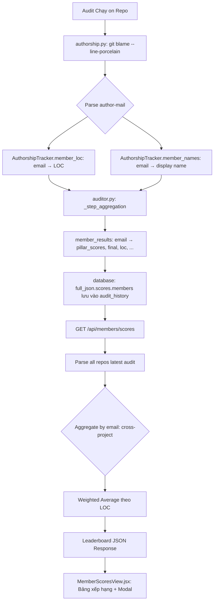

# Tính năng: Member Overview (Cross-Project Leaderboard)

Tính năng này cung cấp **bảng xếp hạng tổng hợp chất lượng code cá nhân** xuyên suốt tất cả các dự án đã được cấu hình, giúp quản lý đánh giá năng lực kỹ thuật của từng thành viên trong team một cách định lượng và khách quan.

## 1. Tổng quan

| Thuộc tính | Giá trị |
|---|---|
| **URL** | `/member-scores` |
| **API** | `GET /api/members/scores` |
| **Router** | `src/api/routers/members.py` |
| **Frontend** | `dashboard/src/components/views/MemberScoresView.jsx` |
| **Dữ liệu nguồn** | `audit_history.full_json → scores.members` |
| **Định danh User** | `author_email` từ `git blame --line-porcelain` |

## 2. Luồng Dữ liệu (Data Flow)

## 3. Cơ chế Định danh Thành viên

- **Khóa chính**: `author_email` — lấy từ dòng `author-mail <email@example.com>` trong output `git blame --line-porcelain`.
- **Hiển thị**: `author_name` — lấy từ dòng `author Name` trong cùng output, lưu kèm vào `member_results` để frontend dùng.
- **Backward Compat**: Audit cũ (trước khi có tính năng này) lưu key bằng tên (name). API `/api/members/scores` xử lý fallback: dùng key gốc như `email` khi trường `email` không tồn tại trong dữ liệu cũ.

> [!WARNING]
> **Edge Case:** Nếu user cấu hình Git với email `not.committed.yet@example.com` (trường hợp commit trên máy không config global email), hệ thống sẽ gộp nhiều người dùng khác nhau vào cùng một bucket không mong muốn. Đây là hạn chế của `git blame` và không thể sửa ở tầng ứng dụng.

## 4. Thuật toán Tính điểm Cross-Project (Weighted Average)

Điểm của một thành viên **KHÔNG phải** là trung bình cộng đơn giản điểm các dự án. Thay vào đó:

1. **Cộng dồn tổng punishment** theo từng Pillar từ tất cả dự án.
2. **Cộng dồn tổng LOC** của thành viên đó qua tất cả dự án.
3. **Tính lại `pillar_score`** từ tổng punishment / tổng LOC bằng `ScoringEngine.calculate_pillar_score()`.
4. **Tính `final_score`** từ các pillar scores bằng `ScoringEngine.calculate_final_score()`.

**Ví dụ:** Nếu developer A viết 10,000 LOC ở Repo X (điểm 90) và 10 LOC ở Repo Y (điểm 50), điểm tổng ≈ 89.9 (ảnh hưởng của Repo Y gần như không đáng kể vì LOC rất nhỏ).

## 5. UI Components (Frontend)

### Leaderboard Table
- Sort đa cột: Điểm, Tên, LOC, Số dự án, Technical Debt.
- **Medal ranks** cho Top 3: 🥇🥈🥉.
- Avatar tự động từ chữ cái đầu của tên.

### KPI Cards
- Tổng thành viên, Điểm trung bình toàn team, Top Performer, Tổng LOC đóng góp.

### Member Detail Modal (Click vào hàng)
- Điểm tổng + Rating badge.
- **Điểm 4 Trụ cột** với thanh tiến trình màu riêng.
- **Phân bổ theo Dự án**: LOC, Điểm, Debt cho từng repo member tham gia.

---
*Duy trì bởi LongDD.*
