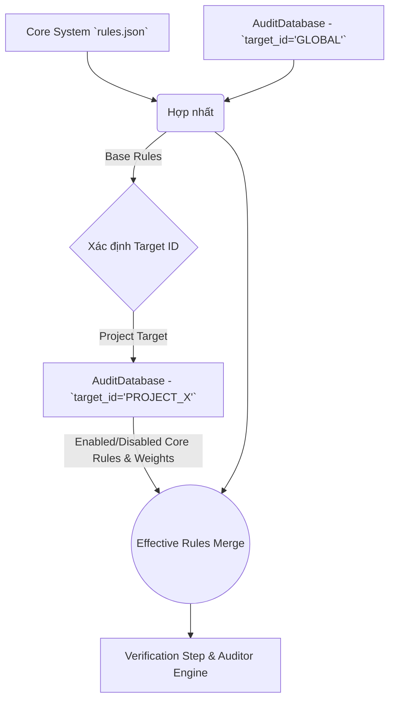

# Natural Language Rule Engine (NLRE) & Rule Manager

## Tổng quan
Hệ thống quản lý luật đánh giá (Rule Manager) bao gồm 3 phần chính:
1. **Luật Mặc định (Core Rules):** Các luật kỹ thuật được định nghĩa sẵn bởi hệ thống, phát hiện bằng **Regex + AST** (như SQL Injection, Code Smells...). Người dùng có thể Tắt/Bật bất cứ luật nào nếu thấy không phù hợp với dự án.
2. **Luật AI-Only (Deep Audit Rules):** Các luật chỉ có thể được phát hiện bởi AI Deep Audit — không có regex hay AST. Hệ thống **tự nhận diện** bằng quy tắc: `regex=null` + `ast=null` + `ai≠null` → AI-only rule. Chỉ cần thêm rule vào `rules.json` theo format này là tự động hoạt động, không cần sửa code.
   - Hiện tại gồm 6 luật: `UNCHECKED_NONE_RETURN`, `SILENT_DATA_CORRUPTION`, `INCONSISTENT_RETURN_TYPE`, `REDUNDANT_DB_QUERY`, `MISLEADING_NAME`, `INSECURE_RANDOM`.
3. **Luật Tùy chỉnh (NLRE):** Tính năng đột phá cho phép mô tả mong muốn thiết lập luật bổ sung bằng Tiếng Việt. AI Agent sẽ hiểu và tạo ra AST & Regex Rules.

Đặc biệt, Code Auditor sử dụng **Two-Stage Audit Pipeline**:
- **Stage 1 (Static Check):** Quét siêu nhanh bằng RegEx và AST Python.
- **Stage 2 (AI Gatekeeper):** AI làm nhiệm vụ rà soát toàn bộ các lỗi tìm được từ Stage 1 nhằm tự động gạt bỏ False Positives. Cả lỗi mặc định và lỗi tùy chỉnh đều bị kiểm tra khắt khe.
- **Stage 3 (AI Deep Audit):** AI quét sâu toàn bộ source code để tìm lỗi logic/kiến trúc. Tại bước này, các luật **AI-Only** được inject vào prompt để AI kiểm tra có hệ thống, và trả về `rule_id` cụ thể thay vì gom chung `AI_REASONING`.

## Điểm Nổi Bật của Rule Manager Mới (V2)
1. **Dễ tiếp cận:** Cung cấp sẵn kho **Prompt Templates Gallery** (VD: Cấm eval, Cấm Hardcode, Giới hạn dòng lệnh) bắt mắt và chỉ cần nhấp để tự động điền prompt.
2. **Interactive Sandbox & Streaming UX:** 
   - Giao diện tách biệt hoàn toàn giữa **Danh sách Rule** và **Tạo Rule AI**. 
   - Tích hợp hiệu ứng **Real-time Streaming (Chain-of-Thought)** hiển thị suy nghĩ của AI khi gen rule.
   - Tính năng Chạy Thử cho phép mô phỏng thực tế xem luật bắt có đúng không, hỗ trợ **Quét 3 Lớp y hệt Auditor (3-Phase Sandbox Audit)**: 
      - (1) Quét Tĩnh
      - (2) AI Gác Cổng (chống báo sai)
      - (3) AI Deep Audit (để test luật AI-Only).
3. **Smart Auto-Healing (AI Gỡ lỗi JSON):** Khả năng gửi lỗi JSON hoặc False Postives từ Test Case ngược lại cho AI thông qua nút bấm **✨ Auto Fix bằng AI**. Hệ thống sẽ tự động gen luồng stream mới khắc phục mã lỗi cấu trúc.
4. **Nâng cấp Quét Ngoại lệ (Exceptions):** Engine đã hỗ trợ phát hiện chuyên sâu cho cả `except:` (Bare except) và `except Exception:` (General Exception catch-all).
5. **Quản trị rủi ro & Trọng số (Weight Override) trực quan:**
   - Cho phép **rê chuột dồn cuộn (Scroll/Wheel)** lên ô số để tinh chỉnh Trọng số Vi phạm tăng/giảm siêu mượt mà.
   - Bất cứ luật gốc (Core Rules) nào gây phiền nhiễu đều có thể "TẮT" (Toggle).
5. **Giảm nhiễu (Zero False Positives):** Nhờ cơ chế AI Gác Cổng (Stage 2), hệ thống loại bỏ những báo cáo sai ngữ cảnh, đảm bảo tính minh bạch.
6. **Cấu hình độc lập & An toàn:** Dành riêng một trang "Cài đặt Cấu hình" chứa **Vùng Nguy Danger Zone** báo đỏ để nhanh chóng khôi phục mặc định.
7. **Tối ưu hiển thị (UI/UX):** Tích hợp tìm kiếm (Search) tốc độ cao và phân nhóm luật theo chuẩn **Pillar** (Security, Performance...) thông qua giao diện Accordion. Việc này giúp quản lý số lượng lớn luật kỹ thuật một cách dễ dàng và đỡ rối mắt.

## Hướng dẫn thao tác Rule Manager
1. Mở trang UI. Nhấp Tab `Danh sách Rule` để sửa đổi Core Rules và Custom Rules bằng thanh trượt trọng số (Mouse wheel).
2. Nhấp Tab `Tạo Rule AI` để mở Sandbox. Chọn Template mồi hoặc gõ mô tả Tiếng Việt. 
3. Nhấn **Biên dịch AI** để sinh ra JSON Rule. (Lưu ý: System sẽ check parse JSON rất nghiêm, cấm dư ngoặc).
4. Khu vực **Code Test** sẽ tự động scale chiều cao giúp bạn gõ thử mã độc, bấm *Run Test* xác nhận độ chuẩn.
5. Cuối cùng, phải ấn "Lưu Tất Cả" thì luật mới chính thức đưa vào dự án chặn lõi.
6. Khi cần làm mới toàn bộ luật của Dự án đang chấm, vào mục *Cài đặt Cấu hình* ở góc dưới cùng > *Reset (Danger Zone)*.

---

## UI Overhaul — Phase 7 (2026-04-10)

Nâng cấp toàn diện giao diện 2 trang `/rules` và `/sandbox` lên tiêu chuẩn premium.

### Rule Manager — Thay đổi

| Thành phần | Trước | Sau |
|---|---|---|
| **KPI Strip** | 4 div màu đơn giản | 4 `KpiCard` có icon lớn, glow orb, accent color, animated entrance |
| **Tab selector** | 2 button phẳng | Gradient active tab (`emerald→teal` / `violet→purple`) + badge count |
| **Filter bar** | 3 `<select>` native | `PillGroup` component — pill buttons với dot màu severity inline |
| **Pillar filter** | `<select>` dropdown | Pill buttons kèm icon pillar (Lock / Gauge / Wrench / FlaskConical) |
| **Category accordion** | Chevron + tên text | Pillar icon màu + badge `active/total` + icon bulk-toggle |
| **Rule card** | Layout flat đơn giản | 3-row: `[ID+Severity]` → `[Description]` → `[Footer Weight+Toggle]` + severity accent top-line |
| **Toggle switch** | Switch nhỏ không nhãn | Switch + label `ON` / `OFF` màu emerald/slate + glow shadow |
| **WeightInput** | Border trắng thường | Border tím + glow khi đang override; dim khi không override |

**Pillar colors mapping:**

| Pillar | Icon | Color |
|---|---|---|
| Security | Lock | Red |
| Performance | Gauge | Amber |
| Maintainability | Wrench | Blue |
| Reliability | FlaskConical | Violet |

### Rule Builder — Thay đổi

| Thành phần | Trước | Sau |
|---|---|---|
| **Stepper** | Vòng tròn số nhỏ | 48px gradient circle + sub-label + progress line fill animation |
| **Step 1 Prompt area** | Textarea + placeholder đơn giản | Char counter + placeholder multi-line có ví dụ thực tế |
| **Template gallery** | 4 button đồng nhất | Phân category separator + icon pillar + selected ring effect (violet glow) |
| **Step 2 Terminal** | Plain text scroll | `StreamingTerminal` component: blink cursor + elapsed time counter + status indicator |
| **JSON editor** | Textarea tím thuần | Border glow emerald khi compile xong; textarea ánh sáng responsive |
| **Step 3 Split pane** | 2 panel đơn giản | Gutter visual dots + violation cards có `border-l` rose + badge Line number |
| **Save button** | Button bình thường | Gradient `emerald→teal` với glow khi ready, pulse animation |

### Bugfix: Step 3 Sandbox Crash (2026-04-14)

| Triệu chứng | Nguyên nhân | Fix |
|---|---|---|
| Click "Tiến Vào Sandbox" → React crash trắng màn hình | `Box` icon (lucide-react) được sử dụng ở Step 3 panel "Kết Quả Phân Tích" (dòng 686) nhưng **không được import** trong `RuleBuilder.jsx` | Thêm `Box` vào danh sách import từ `lucide-react` |

**File:** `dashboard/src/components/nlre/RuleBuilder.jsx` — dòng 3-19 (import block)

### Files thay đổi

- `dashboard/src/components/nlre/RuleManager.jsx` — Viết lại toàn bộ
- `dashboard/src/components/nlre/RuleBuilder.jsx` — Viết lại toàn bộ (+ bugfix import `Box`)
- `dashboard/src/index.css` — Bổ sung: `json-highlight`, `terminal-cursor`, `font-display`, `animate-spin-slow`, utility classes

### New CSS classes

| Class | Mô tả |
|---|---|
| `.json-highlight .json-key/str/bool/num` | Fake syntax highlight cho JSON viewer |
| `.terminal-cursor` | Blinking cursor animation trong streaming log |
| `.font-display` | Shorthand `font-family: 'Outfit'` |
| `.bg-white/3/8/12/18` | Workaround Tailwind JIT opacity utilities |
| `.animate-spin-slow` | Slow 3s rotation |
| `.template-card-selected` | Selected ring violet trên template button |
| `.stepper-line-done` | Gradient fill line cho progress tracker |

---

## 3-Tier Rule Architecture & Override Manager (Phiên bản V3)

Kiến trúc Rule Manager hiện tại đã được nâng cấp lên mô hình 3 tầng (3-Tier Architecture) giúp quản lý phức tạp và cô lập rủi ro qua từng mức cấu hình.

### 1. Kiến trúc 3 Cấp Độ (3-Tier)
- **Tầng 1: Global Rules (Mặc định Hệ thống):** Toàn bộ nền tảng áp dụng chung một bộ luật (core rules). Quản trị viên (Global Admin) có quyền định dạng các thuộc tính như Trạng Thái (Bật/Tắt) hoặc Mật Độ (Weight) cho mục tiêu `target_id='GLOBAL'`.
- **Tầng 2: Project Overrides (Ngoại lệ Dự án):** Các dự án cụ thể sẽ kế thừa quy tắc của Global, nhưng có thể "Ghi Đè" (Override) một trạng thái cụ thể. Ví dụ: Global Tắt rule "A", nhưng Dự Án 1 thiết lập Bật rule "A". Điểm đặc biệt là nếu Global cập nhật các rule "B", Dự Án 1 vẫn tự động được hưởng sái thay đổi đó do tính cô lập.
- **Tầng 3: Custom AI Rules (Luật AI Cá thể):** Cơ chế JSON Độc Lập cho mỗi `target_id` do AI tự tạo, không bị ảnh hưởng và không ảnh hưởng chéo dự án khác.

**Data Flow của Engine CodeAuditor:**

### 2. Giao diện 4 Tabs & Override Manager
- RuleManager UI áp dụng 4 thanh tab độc lập, mỗi tab đều có **icon ℹ️ tooltip** mô tả mục đích khi hover:
  - **Tab 1 - Global Rules:** Chỉnh sửa luật trực tiếp trên Global (Ảnh hưởng đa dự án). Mỗi rule đã bị thay đổi (disable hoặc custom weight) sẽ hiển thị badge **✎ Modified** màu cyan và nút **↺ Default** để reset từng rule riêng lẻ về trạng thái mặc định gốc.
  - **Tab 2 - Project Overrides:** Chỉnh sửa trên dự án hiện tại. Giao diện sẽ hiển thị Badge \"Override Active\" cảnh báo luật này đang đè lên Global.
  - **Tab 3 - Custom AI Rules:** Quản lý JSON Custom.
  - **Tab 4 - Override Manager:** Thống kê siêu cấp (Diff View) mô tả sự khác biệt giữa Dự án và Hệ Thống, kèm nút `Reset to Global` để xóa bỏ nhanh các sai lệch. Không có info box chiếm diện tích — thông tin giải thích chỉ hiển thị qua tooltip icon ℹ️ trên tab.

### 3. Database Schema `project_rules`
- `disabled_core_rules` (JSON Array): Các rules bị tắt bởi Project.
- `enabled_core_rules` (JSON Array): Các rules được bật ép buộc bởi Project nhằm thoát khỏi sự cấm cản từ Global.
- `custom_weights` (JSON Object): Các trọng số bị ghi đè riêng của Project.

### 4. Logic Tính KPI Active Count (Bugfix 2026-04-14)

**Công thức chính xác** cho KPI cards trên dashboard (`RuleManager.jsx` — `dbStats` useMemo):

- **Active Global Rules** = `totalRules - globalDisabled.filter(r => existsInDefaultRules(r)).length`
- **Active Project Rules** = `totalRules - effectiveDisabledCount`, trong đó:
  - `mergedDisabled = (global.disabled ∪ project.disabled) \ project.enabled` (phép set operation)
  - `effectiveDisabledCount` chỉ đếm các rule **tồn tại** trong `defaultRules` (bỏ qua rule đã bị xóa khỏi `rules.json`)

**Backend `toggle_core_rule()`** (`src/engine/database.py`):

- Khi bật rule (`is_disabled=False`) ở scope **GLOBAL**: chỉ xóa khỏi `disabled_core_rules`, **KHÔNG** thêm vào `enabled_core_rules` (vì global không có khái niệm override).
- Khi bật rule ở scope **Project**: xóa khỏi `disabled_core_rules` VÀ thêm vào `enabled_core_rules` (để override global disable nếu có).

### 5. Edge Cases & Gotchas

| Case | Mô tả | Cách xử lý |
|---|---|---|
| Rule bị xóa khỏi `rules.json` nhưng vẫn nằm trong `disabled_core_rules` DB | Có thể gây sai số KPI nếu đếm thô | Frontend filter bằng `allRuleIds.has(r)` trước khi đếm |
| `enabled_core_rules` chứa rule không nằm trong `disabled` set | Có thể xảy ra do data cũ (trước bugfix) | `Set.delete()` là no-op an toàn; KPI dùng set operation nên không bị ảnh hưởng |
| Toggle rule ở Global tab → `enabled_core_rules` của GLOBAL bị phình | Đã fix backend: không thêm vào `enabled_core_rules` khi `target_id == 'GLOBAL'` | Backend guard tại `toggle_core_rule()` |
| Override Manager hiển thị stale ENABLED entries | `enabled_core_rules` chứa rule không bị global disable → override vô nghĩa | Frontend chỉ hiện ENABLED override khi rule **thực sự** nằm trong `globalOverrides.disabled_core_rules` |

### 6. Performance Optimization — `tabEffectiveDisabled` Set (2026-04-14)

`tabEffectiveDisabled` sử dụng kiểu `Set` thay vì `Array` để tra cứu O(1) thay vì O(n):

- **3 callsites** dùng `.has()` thay vì `.includes()`: filter rules, accordion active count, RuleCard disabled prop
- Override Manager badge count chỉ đếm `enabled_core_rules` entries **thực sự override** global disable
- Empty state "Đồng bộ với Global" chỉ hiện khi không có override thực sự (bỏ qua stale entries)

### 7. Bugfix: RuleBuilder fetchRules sai API path (2026-04-15)

| Triệu chứng | Nguyên nhân | Fix |
|---|---|---|
| Lưu Rule ở bước 3 thành công nhưng custom weights bị xóa sạch | `RuleBuilder.fetchRules()` đọc `result.data.custom_weights` thay vì `result.data.project_rules.custom_weights`. Kết quả: `customWeights` luôn = `{}`, khi save → `save_custom_weights({})` → xóa sạch weights cũ. | Sửa path: `const pr = result.data.project_rules` rồi đọc `pr.custom_weights`, `pr.compiled_json`, `pr.natural_text` |

**File:** `dashboard/src/components/nlre/RuleBuilder.jsx` — dòng 62-66 (fetchRules)

### 8. Per-Rule Reset cho Global Tab (2026-04-15)

- **RuleCard** nhận thêm props: `isGlobalCustomized` và `onResetToDefault`.
- Tab **Global**: rule có trong `disabled_core_rules` hoặc `custom_weights` → badge **✎ Modified** (cyan) + nút **↺ Default**.
- Nút **Default** gọi `handleToggleRule(ruleKey, false, true)` → backend xóa rule khỏi cả 3 list của `GLOBAL`.
- Badge **✦ Custom Weight** ẩn khi `isGlobalCustomized=true` để tránh trùng lặp.

### 9. Bugfix: RuleBuilder Save Ghi Đè compiled_json Cũ (2026-04-15)

| Triệu chứng | Nguyên nhân | Fix |
|---|---|---|
| Lưu rule mới ở Rule Builder → rules cũ biến mất | `handleCompile()` reset `compiledJson=null`. AI trả về chỉ rule mới. `handleSave()` ghi đè toàn bộ DB. | Thêm `existingCompiledJson` state. `handleSave()` merge regex/ast/ai rules — deduplicate bằng Set. |

### 10. Bugfix: Tab Custom Không Hiển Thị ai_rules (2026-04-15)

| Triệu chứng | Nguyên nhân | Fix |
|---|---|---|
| AI-only rule lưu OK nhưng tab Custom hiện "Chưa có" | Tab chỉ render `regex_rules` + `ast_rules`, bỏ sót `ai_rules` | Thêm render ai_rules cards (cyan) + empty state check + delete/weight handler cho type `"ai"` |
