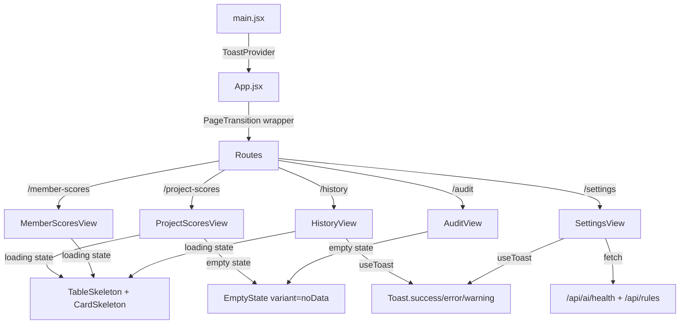

# UI Overhaul — Design System & Polish

## Tổng quan
Phiên nâng cấp UI/UX toàn diện được triển khai ngày 2026-04-06, tập trung vào: Design token system, skeleton loading, animated components, page transitions, và enriched settings/history views.

## Các thay đổi chi tiết

### 1. Design Token System (CSS Variables)
- **File**: `dashboard/src/index.css`
- Bổ sung tokens: `--accent-green`, `--accent-cyan`, `--accent-pink`, `--accent-amber`
- Spacing scale: `--space-xs` → `--space-2xl`
- Border radius scale: `--radius-sm` → `--radius-full`
- Transition easing: `--ease-spring`, `--ease-smooth`, `--duration-fast/normal/slow`

### 2. Skeleton Loading System
- **File**: `dashboard/src/components/ui/SkeletonLoader.jsx`
- Exported components: `TableSkeleton`, `CardSkeleton`, `HeaderSkeleton`, `ScoreRingSkeleton`
- CSS shimmer animation: gradient sweep 1.8s infinite
- Được áp dụng cho: ProjectScoresView, MemberScoresView, HistoryView

### 3. EmptyState Component
- **File**: `dashboard/src/components/ui/EmptyState.jsx`
- Variants: `empty`, `noData`, `error`, `noResults`
- Animated floating dots, spring icon entrance
- Glassmorphism background blur
- Được áp dụng cho: HistoryView, ProjectScoresView, MemberScoresView, AuditView

### 4. Page Transitions
- **File**: `dashboard/src/components/ui/PageTransition.jsx`
- Framer Motion `AnimatePresence mode="wait"` wrapper
- Fade + slide + blur effect: `opacity: 0, y: 14, blur(4px)` → `opacity: 1, y: 0, blur(0px)`
- Wrapped around `<Routes>` in `App.jsx`

### 5. Animated Score Ring (AuditView)
- **File**: `dashboard/src/components/views/AuditView.jsx`
- SVG circle animation thay thế hiển thị text thuần
- `motion.circle` với `strokeDasharray/strokeDashoffset` animation (1.4s ease)
- Color-coded glow filter: `drop-shadow(0 0 8px <color>66)`
- Score number: spring entrance animation (delay 0.5s)

### 6. Animated Pillar Bars (AuditView)
- Motion.div staggered entrance: `delay: 0.3 + idx * 0.1`
- Motion.div width animation: `0% → target%` (0.8s ease)
- Glow effect: `box-shadow: 0 0 12px <color>44`

### 7. HistoryView Enrichment
- **File**: `dashboard/src/components/views/HistoryView.jsx`
- 4 KPI stat cards: Total scans, Avg score, Best score, Last audit
- Relative time formatting: "33m ago", "7h ago", "2d ago"
- Score mini-bar: animated gradient fill
- Color-coded violation badges: ≤100 green, ≤500 amber, >500 rose
- Skeleton loading thay spinner thuần

### 8. SettingsView Expansion
- **File**: `dashboard/src/components/views/SettingsView.jsx`
- **System Information**: AI Health status, Engine version, Framework, AI Model
- **Engine Configuration**: Core rules count, Custom AI rules, Disabled rules (fetched from API)
- **Quick Links**: API Health, Active Repositories, Documentation
- Giữ nguyên Danger Zone section

### 9. ProjectScoresView Polish
- **File**: `dashboard/src/components/views/ProjectScoresView.jsx`
- Relative time (`7h ago`) thay vì date format Việt
- Animated score bar: `motion.div width 0→pct%` với glow shadow
- Skeleton + EmptyState thay spinner + div tĩnh

### 10. MemberScoresView Polish
- **File**: `dashboard/src/components/views/MemberScoresView.jsx`
- Skeleton + EmptyState thay spinner + div tĩnh

### 11. Sidebar Active Glow + Responsive Refactor
- **File**: `dashboard/src/components/layout/Sidebar.jsx`
- Thêm CSS class `glow-pink`, `glow-cyan`, `glow-violet`, `glow-emerald`, `glow-blue`, `glow-amber` cho active state
- Hiệu ứng: `box-shadow: 0 0 20px -4px rgba(<color>, 0.3)`
- **Data-driven nav items**: Refactor từ 6 button blocks → config array, giảm ~50% boilerplate
- **Tailwind JIT Fix**: KHÔNG dùng template literal `bg-${color}-500/10` — phải dùng full class string, vì Tailwind JIT scanner không detect dynamic class names

### 15. Suspense Fallback Upgrade
- **File**: `dashboard/src/App.jsx`
- 7 `<Suspense>` fallback thay từ plain text "Loading..." → `<CardSkeleton>` + `<TableSkeleton>`
- Nhất quán loading experience trên toàn bộ lazy-loaded routes

## Glow Effect Classes (CSS Utilities)
| Class | Color | Dùng cho |
|---|---|---|
| `glow-pink` | Pink | Project Leaderboard active |
| `glow-cyan` | Cyan | Member Leaderboard active |
| `glow-violet` | Violet | Dashboard active |
| `glow-emerald` | Emerald | Rule Manager active |
| `glow-blue` | Blue | Rule Builder active |
| `glow-amber` | Amber | Audit History active |

## Severity Indicator Classes
| Class | Color | Usage |
|---|---|---|
| `severity-blocker` | Red + 0.6 glow | Critical violations |
| `severity-critical` | Orange + 0.5 glow | Critical violations |
| `severity-major` | Yellow + 0.4 glow | Major violations |
| `severity-minor` | Blue + 0.4 glow | Minor violations |
| `severity-info` | Gray | Informational |

### 12. Toast Notification System
- **File**: `dashboard/src/components/ui/Toast.jsx`
- Context-based: `ToastProvider` wraps App trong `main.jsx`
- `useToast()` hook returns: `toast.success()`, `toast.error()`, `toast.warning()`, `toast.info()`
- Spring animation (stiffness: 400, damping: 25), slide-in từ phải
- 4 variants: success (emerald), error (rose), warning (amber), info (blue)
- Auto-dismiss: success/warning/info → 4s, error → 6s
- Glassmorphism + glow effect per variant
- Thay thế toàn bộ `alert()` natives trong SettingsView và HistoryView

### 13. Responsive Mobile Sidebar
- **File**: `dashboard/src/components/layout/Sidebar.jsx`
- Desktop (`lg:` ≥1024px): sidebar cố định, collapse button
- Mobile (`< 1024px`): Sidebar ẩn, hiển thị hamburger button (`Menu` icon) fixed top-left
- Khi tap hamburger → sidebar drawer slide-in từ trái (`spring stiffness: 300, damping: 30`)
- Backdrop overlay: `bg-black/60 backdrop-blur-sm` — tap để đóng
- Close button (`X`) bên trong sidebar header
- Auto-close khi tap nav item

### 14. Responsive CSS Media Queries
- **File**: `dashboard/src/index.css`
- `@media (max-width: 1023px)`: 2-column stats grid, stacked hero card, hamburger padding
- `@media (max-width: 640px)`: 1-column stats grid, stacked header

## Data Flow

### 16. Color & Visual Enhancement (Phase 2)
- **KPI Stat Cards** (Project/Member/History views):
  - Border accent colors per metric: `border-pink-500/25`, `border-amber-500/25`, `border-emerald-500/25`, etc.
  - Subtle glow shadows: `shadow-[0_0_15px_-5px_rgba(...)]`
  - Icon wrapped in rounded container: `w-9 h-9 rounded-xl bg-white/5`
  - Hover: `hover:bg-white/[0.06]`
- **Settings InfoCard** fix: Tailwind JIT dynamic `bg-${color}-500/10` → full class strings
- **Settings Rules Fetch** fix: parse `resp.data.default_rules` instead of `d.rules` (API schema mismatch)
- **Score Bars**: Solid color → gradient:
  - ≥90: `from-emerald-500 to-teal-400`
  - ≥80: `from-blue-500 to-cyan-400`
  - ≥65: `from-amber-500 to-yellow-400`
  - <65: `from-rose-500 to-pink-400`
  - Height: `h-1.5` → `h-2`
- **Table Headers**: `bg-white/2 border-white/5` → `bg-white/[0.04] border-white/[0.08]`
- **Table Row Hover**: `hover:bg-white/3` → `hover:bg-white/[0.05]` + accent left border:
  - Project: `hover:border-l-pink-500/50`
  - Member: `hover:border-l-cyan-500/50`
  - History: `hover:border-l-amber-500/50`
- **Table Footer**: Added `bg-white/[0.02]` background for subtle separation

---
*Cập nhật: 2026-04-06 — LongDD*
