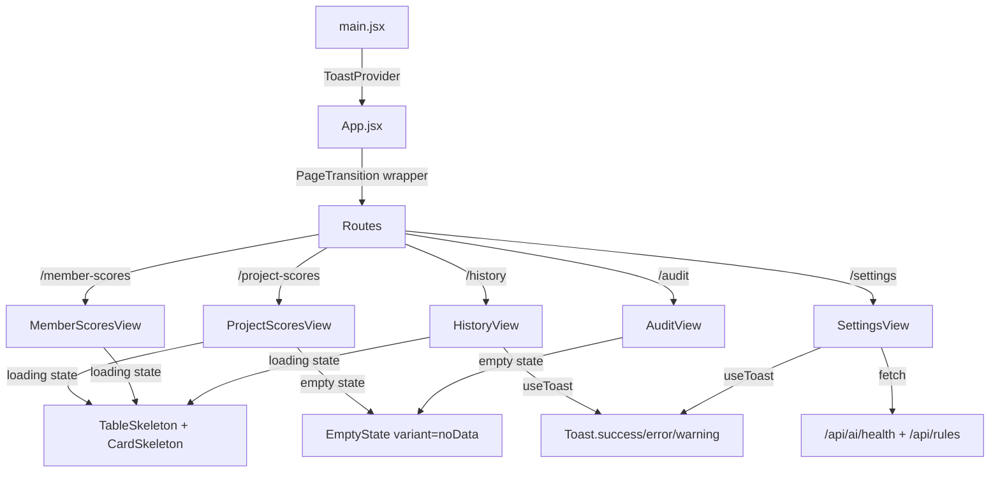

# UI Overhaul — Design System & Polish

## Tổng quan
Phiên nâng cấp UI/UX toàn diện được triển khai ngày 2026-04-06, tập trung vào: Design token system, skeleton loading, animated components, page transitions, và enriched settings/history views.

## Các thay đổi chi tiết

### 1. Design Token System (CSS Variables)
- **File**: `dashboard/src/index.css`
- Bổ sung tokens: `--accent-green`, `--accent-cyan`, `--accent-pink`, `--accent-amber`
- Spacing scale: `--space-xs` → `--space-2xl`
- Border radius scale: `--radius-sm` → `--radius-full`
- Transition easing: `--ease-spring`, `--ease-smooth`, `--duration-fast/normal/slow`

### 2. Skeleton Loading System
- **File**: `dashboard/src/components/ui/SkeletonLoader.jsx`
- Exported components: `TableSkeleton`, `CardSkeleton`, `HeaderSkeleton`, `ScoreRingSkeleton`
- CSS shimmer animation: gradient sweep 1.8s infinite
- Được áp dụng cho: ProjectScoresView, MemberScoresView, HistoryView

### 3. EmptyState Component
- **File**: `dashboard/src/components/ui/EmptyState.jsx`
- Variants: `empty`, `noData`, `error`, `noResults`
- Animated floating dots, spring icon entrance
- Glassmorphism background blur
- Được áp dụng cho: HistoryView, ProjectScoresView, MemberScoresView, AuditView

### 4. Page Transitions
- **File**: `dashboard/src/components/ui/PageTransition.jsx`
- Framer Motion `AnimatePresence mode="wait"` wrapper
- Fade + slide + blur effect: `opacity: 0, y: 14, blur(4px)` → `opacity: 1, y: 0, blur(0px)`
- Wrapped around `<Routes>` in `App.jsx`

### 5. Animated Score Ring (AuditView)
- **File**: `dashboard/src/components/views/AuditView.jsx`
- SVG circle animation thay thế hiển thị text thuần
- `motion.circle` với `strokeDasharray/strokeDashoffset` animation (1.4s ease)
- Color-coded glow filter: `drop-shadow(0 0 8px <color>66)`
- Score number: spring entrance animation (delay 0.5s)

### 6. Animated Pillar Bars (AuditView)
- Motion.div staggered entrance: `delay: 0.3 + idx * 0.1`
- Motion.div width animation: `0% → target%` (0.8s ease)
- Glow effect: `box-shadow: 0 0 12px <color>44`

### 7. HistoryView Enrichment
- **File**: `dashboard/src/components/views/HistoryView.jsx`
- 4 KPI stat cards: Total scans, Avg score, Best score, Last audit
- Relative time formatting: "33m ago", "7h ago", "2d ago"
- Score mini-bar: animated gradient fill
- Color-coded violation badges: ≤100 green, ≤500 amber, >500 rose
- Skeleton loading thay spinner thuần

### 8. SettingsView Expansion
- **File**: `dashboard/src/components/views/SettingsView.jsx`
- **System Information**: AI Health status, Engine version, Framework, AI Model
- **Engine Configuration**: Core rules count, Custom AI rules, Disabled rules (fetched from API)
- **Quick Links**: Documentation
- Giữ nguyên Danger Zone section

### 9. ProjectScoresView Polish
- **File**: `dashboard/src/components/views/ProjectScoresView.jsx`
- Relative time (`7h ago`) thay vì date format Việt
- Animated score bar: `motion.div width 0→pct%` với glow shadow
- Skeleton + EmptyState thay spinner + div tĩnh

### 10. MemberScoresView Polish
- **File**: `dashboard/src/components/views/MemberScoresView.jsx`
- Skeleton + EmptyState thay spinner + div tĩnh

### 11. Sidebar Active Glow + Responsive Refactor
- **File**: `dashboard/src/components/layout/Sidebar.jsx`
- Thêm CSS class `glow-pink`, `glow-cyan`, `glow-violet`, `glow-emerald`, `glow-blue`, `glow-amber` cho active state
- Hiệu ứng: `box-shadow: 0 0 20px -4px rgba(<color>, 0.3)`
- **Data-driven nav items**: Refactor từ 6 button blocks → config array, giảm ~50% boilerplate
- **Tailwind JIT Fix**: KHÔNG dùng template literal `bg-${color}-500/10` — phải dùng full class string, vì Tailwind JIT scanner không detect dynamic class names

### 15. Suspense Fallback Upgrade
- **File**: `dashboard/src/App.jsx`
- 7 `<Suspense>` fallback thay từ plain text "Loading..." → `<CardSkeleton>` + `<TableSkeleton>`
- Nhất quán loading experience trên toàn bộ lazy-loaded routes

## Glow Effect Classes (CSS Utilities)
| Class | Color | Dùng cho |
|---|---|---|
| `glow-pink` | Pink | Project Leaderboard active |
| `glow-cyan` | Cyan | Member Leaderboard active |
| `glow-violet` | Violet | Dashboard active |
| `glow-emerald` | Emerald | Rule Manager active |
| `glow-blue` | Blue | Rule Builder active |
| `glow-amber` | Amber | Audit History active |

## Severity Indicator Classes
| Class | Color | Usage |
|---|---|---|
| `severity-blocker` | Red + 0.6 glow | Critical violations |
| `severity-critical` | Orange + 0.5 glow | Critical violations |
| `severity-major` | Yellow + 0.4 glow | Major violations |
| `severity-minor` | Blue + 0.4 glow | Minor violations |
| `severity-info` | Gray | Informational |

### 12. Toast Notification System
- **File**: `dashboard/src/components/ui/Toast.jsx`
- Context-based: `ToastProvider` wraps App trong `main.jsx`
- `useToast()` hook returns: `toast.success()`, `toast.error()`, `toast.warning()`, `toast.info()`
- Spring animation (stiffness: 400, damping: 25), slide-in từ phải
- 4 variants: success (emerald), error (rose), warning (amber), info (blue)
- Auto-dismiss: success/warning/info → 4s, error → 6s
- Glassmorphism + glow effect per variant
- Thay thế toàn bộ `alert()` natives trong SettingsView và HistoryView

### 13. Responsive Mobile Sidebar
- **File**: `dashboard/src/components/layout/Sidebar.jsx`
- Desktop (`lg:` ≥1024px): sidebar cố định, collapse button
- Mobile (`< 1024px`): Sidebar ẩn, hiển thị hamburger button (`Menu` icon) fixed top-left
- Khi tap hamburger → sidebar drawer slide-in từ trái (`spring stiffness: 300, damping: 30`)
- Backdrop overlay: `bg-black/60 backdrop-blur-sm` — tap để đóng
- Close button (`X`) bên trong sidebar header
- Auto-close khi tap nav item

### 14. Responsive CSS Media Queries
- **File**: `dashboard/src/index.css`
- `@media (max-width: 1023px)`: 2-column stats grid, stacked hero card, hamburger padding
- `@media (max-width: 640px)`: 1-column stats grid, stacked header

## Data Flow



### 16. Color & Visual Enhancement (Phase 2)
- **KPI Stat Cards** (Project/Member/History views):
  - Border accent colors per metric: `border-pink-500/25`, `border-amber-500/25`, `border-emerald-500/25`, etc.
  - Subtle glow shadows: `shadow-[0_0_15px_-5px_rgba(...)]`
  - Icon wrapped in rounded container: `w-9 h-9 rounded-xl bg-white/5`
  - Hover: `hover:bg-white/[0.06]`
- **Settings InfoCard** fix: Tailwind JIT dynamic `bg-${color}-500/10` → full class strings
- **Settings Rules Fetch** fix: parse `resp.data.default_rules` instead of `d.rules` (API schema mismatch)
- **Score Bars**: Solid color → gradient:
  - ≥90: `from-emerald-500 to-teal-400`
  - ≥80: `from-blue-500 to-cyan-400`
  - ≥65: `from-amber-500 to-yellow-400`
  - <65: `from-rose-500 to-pink-400`
  - Height: `h-1.5` → `h-2`
- **Table Headers**: `bg-white/2 border-white/5` → `bg-white/[0.04] border-white/[0.08]`
- **Table Row Hover**: `hover:bg-white/3` → `hover:bg-white/[0.05]` + accent left border:
  - Project: `hover:border-l-pink-500/50`
  - Member: `hover:border-l-cyan-500/50`
  - History: `hover:border-l-amber-500/50`
- **Table Footer**: Added `bg-white/[0.02]` background for subtle separation

### 17. Midnight Aurora Premium Dark Theme (Phase 3)
- **File**: `dashboard/src/index.css`, `dashboard/src/App.jsx`
- Quyết định: Huỷ bỏ chuyển đổi sang Light Theme (do gây chói/mỏi mắt khi đọc log/code), chuyển sang làm sâu và tối ưu Dark Theme hiện tại.
- **Base Color (`index.css`)**: Tổi màu nền gốc từ `--bg-color: #020617` sang `#080c14` sâu hơn, loại bỏ hoàn toàn khối override `.light` dính chặt vào tailwind class cũ.
- **Glassmorphism Enhancement**:
  - `backdrop-filter: blur(16px) saturate(160%)` thay vì 12px.
  - Tăng độ sáng viền: `--glass-border: rgba(139, 92, 246, 0.15)`.
- **Glowing Orbs (App.jsx & index.css)**:
  - Cập nhật 3 radial-gradient chìm ở Body với các mã màu `rgba(139, 92, 246, 0.15)`, `rgba(16, 185, 129, 0.1)`. Không dùng `opacity: 0.1` CSS thuần mà ép màu RGBa với alpha gốc để tăng mức độ rực rỡ dưới lớp kính.

### 18. Triệt tiêu Radar Chart — HeroCard Component (Phase 4)
- **File mới**: `dashboard/src/components/ui/HeroCard.jsx`
- **File sửa**: `dashboard/src/components/views/AuditView.jsx`
- **Vấn đề**: Radar Chart bản chất hình tròn, đặt trong khung hình chữ nhật nằm ngang luôn tạo ra khoảng trống lớn 2 bên lề. Thử nghiệm 3-Column Layout cũng không hợp mắt vì 3 cột rời rạc, thiếu liên kết thị giác.
- **Giải pháp cuối cùng — 2-Row Layout**:
  - Tách toàn bộ Hero Card ra thành component riêng `HeroCard.jsx` để giảm độ phức tạp của `AuditView.jsx`.
  - **Hàng 1**: Score Ring (bên trái) + 4 Pillar Progress Bars kéo full-width (bên phải), ngăn cách bằng divider dọc mỏng. Các thanh progress bar trải đều toàn bộ chiều ngang còn lại, không còn khoảng trống.
  - **Hàng 2**: 4 KPI mini-cards (Lines of Code, Features, Violations, Weakest Module) dạng grid 4 cột, có hover effect và icon accent riêng biệt.
  - Loại bỏ hoàn toàn Radar Chart và panel "Attention Required" tách rời ra khỏi Hero Card.

### 19. UI/UX Professional Overhaul (Phase 5 — 2026-04-06)

#### 19.1 Visual Foundation
- **Rank Badges** (thay thế emoji 🥇🥈🥉):
  - Gold: `linear-gradient(135deg, #fbbf24, #f59e0b)` + `box-shadow: 0 0 12px rgba(251,191,36,0.4)`
  - Silver: `linear-gradient(135deg, #d1d5db, #9ca3af)` + glow
  - Bronze: `linear-gradient(135deg, #d97706, #b45309)` + glow
  - Default (#4+): `bg-white/6` circle với số thưởng tự
  - **Files**: `ProjectScoresView.jsx`, `MemberScoresView.jsx`, `index.css` (`.rank-badge-*` classes)

- **Score Dot Indicators**: Chấm tròn 6px phát sáng cạnh score number
  - CSS classes: `.score-dot-emerald/blue/amber/orange/rose`
  - Áp dụng tại: ProjectScoresView, MemberScoresView (table score column)

- **Premium Table Styling** (`.premium-table` class):
  - Zebra striping: odd rows `rgba(255,255,255,0.015)`
  - Left accent border hover: `border-left: 2px solid var(--table-accent)`
  - Compact header: `font-size: 9px`, `letter-spacing: 0.15em`
  - **Files**: `index.css`, `ProjectScoresView.jsx`, `MemberScoresView.jsx`, `AuditView.jsx`

#### 19.2 Information Architecture
- **KPI Accent Cards** (`.kpi-accent-card` class):
  - Top accent line gradient 2px per metric: pink, amber, emerald, orange, cyan, violet
  - Áp dụng tại: `ProjectScoresView`, `MemberScoresView`, `HeroCard` KPI strip
  - **Files**: `index.css` (`.kpi-accent-*::before` pseudo-elements)

- **Feature Cards → Collapsible Table** (`FeatureTable` component):
  - **File**: `AuditView.jsx`
  - Thay thế 22 feature glass cards → 1 table `MODULE BREAKDOWN`
  - Click row → ~~expand hiện 4-pillar breakdown~~ → **Thay đổi**: 4 pillar hiển thị trực tiếp inline trong mỗi row
  - Cột: `Module | Score | Perf. | Maint. | Relia. | Secur. | LOC | Debt`
  - Mỗi pillar cell: score number + animated mini progress bar
  - Component `PillarCell`: score color-coded + `motion.div` width animation
  - Sorted ascending by score (weakest first)

- **Compact Page Headers**:
  - Badge + subtitle inline cùng dòng (thay vì subtitle dưới title)
  - `mb-8 → mb-5`, `gap-6 → gap-4`
  - Title giữ gradient nhưng mô tả chuyển sang inline
  - **Files**: `ProjectScoresView.jsx`, `MemberScoresView.jsx`

- **View Toggle Buttons** (AuditView):
  - Chuyển từ inline style → Tailwind classes
  - Compact hơn: `px-4 py-2` thay `0.8rem 1.75rem`

#### 19.3 Micro-polish
- **Gradient Avatars** per member (`.avatar-gradient` class):
  - Hash-based gradient: `hsl(hash%360, 65%, 50%) → hsl((hash+40)%360, 65%, 40%)`
  - Hover: `scale(1.08)` + border brighten + shadow
  - Thay thế avatar generic `bg-cyan-500/20` giống nhau
  - **File**: `MemberScoresView.jsx`, `index.css`

- **Debt Format** human-readable:
  - Hàm `formatDebt(mins)`: `1715 → "1d 4h"`, `110 → "1h 50m"`, `2 → "2m"`
  - Color coding: `≤60m → debt-low (slate)`, `≤480m → debt-medium (amber)`, `>480m → debt-high (rose)`
  - Tooltip hover hiện giá trị phút gốc
  - **File**: `MemberScoresView.jsx`

#### 19.4 Tổng kết CSS Classes mới

| Class | Mô tả |
|---|---|
| `.rank-badge` | Base rank badge circle 28px |
| `.rank-badge-gold/silver/bronze/default` | Variant gradient colors |
| `.kpi-accent-card` | Card with top accent line |
| `.kpi-accent-pink/amber/emerald/orange/cyan/violet` | Accent line colors |
| `.premium-table` | Table với zebra + accent hover |
| `.score-dot` | Dot indicator 6px base |
| `.score-dot-emerald/blue/amber/orange/rose` | Dot colors + glow |
| `.avatar-gradient` | Gradient member avatar 36px |
| `.page-header-compact` | Compact header sizing |
| `.debt-low/medium/high` | Debt color coding |


### 20. Header Layout Synchronization (Phase 5b — 2026-04-06)
- **Vấn đề**: Header layout không đồng nhất — một số trang dùng badge + subtitle trên 2 dòng riêng biệt, một số lại inline.
- **Giải pháp**: Chuẩn hóa toàn bộ 7 trang theo layout thống nhất:
  - **Dòng 1**: `[Badge pill]` + subtitle text inline cùng hàng
  - **Dòng 2**: Big gradient title bên dưới
  - Badge: `text-xs`, icon `14px`, padding `px-3 py-1.5`
  - Subtitle: `text-slate-600 text-xs font-medium`, hidden on mobile (`hidden sm:block`)
- **Files thay đổi**:
  - `App.jsx`: Audit Dashboard, Rule Manager, Rule Builder headers
  - `HistoryView.jsx`: Audit History header
  - `SettingsView.jsx`: System Settings header
  - (ProjectScoresView, MemberScoresView đã sửa ở Phase 5 trước đó)


### 21. Table Pagination (Phase 5c — 2026-04-06)
- **Component mới**: `components/ui/Pagination.jsx`
  - Reusable, dark theme, page numbers + ellipsis
  - First/Last/Prev/Next navigation
  - Optional page-size selector (`5 / 10 / 20 / 50`)
  - Auto-hide khi tổng items <= pageSize (1 page)
  - Props: `currentPage`, `totalItems`, `pageSize`, `onPageChange`, `onPageSizeChange`, `label`
- **Tích hợp**:
  - `ProjectScoresView.jsx`: 10 items/page, "Showing 1–10 of N projects"
  - `MemberScoresView.jsx`: 10 items/page, "Showing 1–10 of N members"
  - `AuditView.jsx` (FeatureTable): 10 items/page, "Showing 1–10 of N modules"
  - `HistoryView.jsx`: 10 items/page, "Showing 1–10 of N records"
- **Rank số thứ tự**: Cập nhật rank = `(page - 1) * pageSize + idx + 1` để rank chính xác across pages

---

### 22. Sidebar Navigation Context Separation (Phase 6 — 2026-04-07)

- **File**: `dashboard/src/components/layout/Sidebar.jsx`
- **Vấn đề**: Toàn bộ nav items (bao gồm Project Leaderboard, Member Leaderboard, Presentations) được render bên dưới dropdown "Current repository", tạo ra sự hiểu nhầm rằng các tính năng toàn cục này phụ thuộc vào repo đang được chọn.
- **Giải pháp**: Chia nav items thành 2 arrays riêng biệt và render chúng trong 2 section độc lập:

#### 22.1 Cấu trúc mới — `globalNavItems`

Các tính năng **không phụ thuộc** vào repository (dữ liệu toàn hệ thống):

| Label | Path | Icon | Color |
|---|---|---|---|
| Project Leaderboard | `/project-scores` | BarChart3 | Pink |
| Member Leaderboard | `/member-scores` | Users | Cyan |
| Presentations | `/presentations` | MonitorPlay | Rose |

#### 22.2 Cấu trúc mới — `repoNavItems`

Các tính năng **phụ thuộc** vào repository đang được chọn. Nhóm này được đặt bên dưới dropdown chọn repo:

| Label | Path | Icon | Color |
|---|---|---|---|
| Audit Dashboard | `/audit` | Activity | Violet |
| Rule Manager | `/rules` | ShieldCheck | Emerald |
| Rule Builder | `/sandbox` | Wand2 | Blue |
| Audit History | `/history` | FileSearch | Amber |

#### 22.3 Layout Sidebar sau thay đổi

```
┌──────────────────────────────┐
│  AUDIT ENGINE  [Framework V4]│  ← Logo Header
├──────────────────────────────┤
│  🌐 GLOBAL VIEWS             │  ← Section header mới
│    [Project Leaderboard]     │
│    [Member Leaderboard]      │
│    [Presentations]           │
├──────────────────────────────┤  ← Divider (border-t border-white/5)
│  📁 REPOSITORY WORKSPACE     │  ← Section header mới
│    [select repo dropdown]    │  ← Dropdown được nhóm vào đây
│    [Audit Dashboard]         │
│    [Rule Manager]            │
│    [Rule Builder]            │
│    [Audit History]           │
├──────────────────────────────┤
│  ● AI healthy   [Settings]   │  ← Footer
└──────────────────────────────┘
```

#### 22.4 Chi tiết UI

- **Section headers**: `text-[10px] font-bold text-slate-500 uppercase tracking-widest opacity-70`
- **Global Views header icon**: `Globe` (10px, text-slate-500)
- **Repository Workspace header icon**: `FolderOpen` (10px, text-slate-500)
- **Repo dropdown** kế thừa `border-violet-500/20` thay vì `border-slate-700` để nhất quán với theme violet của Workspace section
- **Repo icon (collapsed mode)**: `bg-violet-500/10 border-violet-500/20` thay vì `bg-slate-800/50 border-slate-700` — phân biệt rõ hơn khi sidebar thu nhỏ
- **renderNavItems** helper: Abstract hóa render logic thành 1 function tái sử dụng cho cả 2 nhóm

#### 22.5 Collapsed Sidebar Behavior

Khi sidebar ở chế độ thu nhỏ (80px wide):
- Section header hiển thị `•••` thay vì text đầy đủ
- Dropdown repo thu lại thành icon `FolderOpen` violet
- Nav items chỉ hiển thị icon (tooltip `title` vẫn hoạt động)

---
*Cập nhật: 2026-04-07 — Sidebar Context Separation Phase 6*

### 23. Global Brightness Uplift (Phase 7 — 2026-04-11)

**Mục tiêu:** Nâng sáng toàn bộ giao diện dashboard để tăng khả năng đọc và giảm cảm giác nặng nề.

#### 23.1 CSS Variables (index.css)
| Token | Trước | Sau |
|---|---|---|
| `--bg-color` | `#080c14` | `#0c1222` |
| `--card-bg` | `rgba(13,17,28, 0.7)` | `rgba(16,22,38, 0.65)` |
| `--glass-border` | `rgba(violet, 0.15)` | `rgba(violet, 0.2)` |
| `--glass-shine` | `rgba(white, 0.03)` | `rgba(white, 0.06)` |
| `--primary-glow` | `rgba(blue, 0.2)` | `rgba(blue, 0.25)` |
| `--secondary-glow` | `rgba(violet, 0.2)` | `rgba(violet, 0.25)` |

#### 23.2 Batch Color Migration (tất cả JSX components)
| Pattern cũ | Pattern mới | Lý do |
|---|---|---|
| `bg-[#080c14]/40` | `bg-[#0f1629]/50` | Nền card panel sáng hơn |
| `bg-[#080c14]/80` | `bg-[#0f1629]/60` | Sidebar, modal overlay |
| `bg-[#060a10]` | `bg-[#0c1222]` | Terminal/editor backgrounds |
| `bg-[#0d1117]` | `bg-[#101828]` | Warning/error modals |
| `bg-black/40` | `bg-white/[0.06]` | Inner element backgrounds |
| `bg-black/30` | `bg-white/[0.05]` | Secondary backgrounds |
| `bg-black/20` | `bg-white/[0.03]` | Subtle tinting |
| `bg-black/10` | `bg-white/[0.02]` | Very subtle tinting |
| `#0f172a` | `#131b2e` (index.css) | Explorer modal, select options |

#### 23.3 Files bị ảnh hưởng
- `dashboard/src/index.css` (global variables + body gradient)
- `dashboard/src/App.jsx` (header controls)
- `dashboard/src/components/layout/Sidebar.jsx` (sidebar bg)
- `dashboard/src/components/views/ProjectScoresView.jsx`
- `dashboard/src/components/views/MemberScoresView.jsx`
- `dashboard/src/components/views/HistoryView.jsx`
- `dashboard/src/components/views/SettingsView.jsx`
- `dashboard/src/components/nlre/RuleManager.jsx`
- `dashboard/src/components/nlre/RuleBuilder.jsx`
- `dashboard/src/components/ui/TerminalLogs.jsx`
- `dashboard/src/components/ui/SkeletonLoader.jsx`

---
*Cập nhật: 2026-04-11 — Global Brightness Uplift Phase 7*

