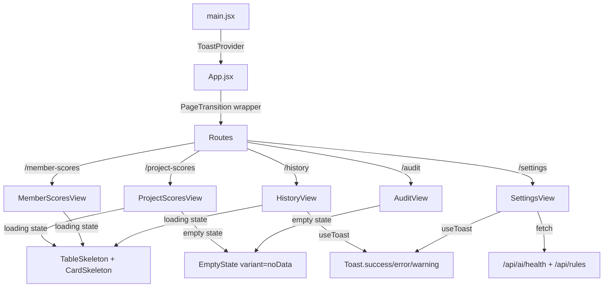

# UI Overhaul — Design System & Polish

## Tổng quan
Phiên nâng cấp UI/UX toàn diện được triển khai ngày 2026-04-06, tập trung vào: Design token system, skeleton loading, animated components, page transitions, và enriched settings/history views.

## Các thay đổi chi tiết

### 1. Design Token System (CSS Variables)
- **File**: `dashboard/src/index.css`
- Bổ sung tokens: `--accent-green`, `--accent-cyan`, `--accent-pink`, `--accent-amber`
- Spacing scale: `--space-xs` → `--space-2xl`
- Border radius scale: `--radius-sm` → `--radius-full`
- Transition easing: `--ease-spring`, `--ease-smooth`, `--duration-fast/normal/slow`

### 2. Skeleton Loading System
- **File**: `dashboard/src/components/ui/SkeletonLoader.jsx`
- Exported components: `TableSkeleton`, `CardSkeleton`, `HeaderSkeleton`, `ScoreRingSkeleton`
- CSS shimmer animation: gradient sweep 1.8s infinite
- Được áp dụng cho: ProjectScoresView, MemberScoresView, HistoryView

### 3. EmptyState Component
- **File**: `dashboard/src/components/ui/EmptyState.jsx`
- Variants: `empty`, `noData`, `error`, `noResults`
- Animated floating dots, spring icon entrance
- Glassmorphism background blur
- Được áp dụng cho: HistoryView, ProjectScoresView, MemberScoresView, AuditView

### 4. Page Transitions
- **File**: `dashboard/src/components/ui/PageTransition.jsx`
- Framer Motion `AnimatePresence mode="wait"` wrapper
- Fade + slide + blur effect: `opacity: 0, y: 14, blur(4px)` → `opacity: 1, y: 0, blur(0px)`
- Wrapped around `<Routes>` in `App.jsx`

### 5. Animated Score Ring (AuditView)
- **File**: `dashboard/src/components/views/AuditView.jsx`
- SVG circle animation thay thế hiển thị text thuần
- `motion.circle` với `strokeDasharray/strokeDashoffset` animation (1.4s ease)
- Color-coded glow filter: `drop-shadow(0 0 8px <color>66)`
- Score number: spring entrance animation (delay 0.5s)

### 6. Animated Pillar Bars (AuditView)
- Motion.div staggered entrance: `delay: 0.3 + idx * 0.1`
- Motion.div width animation: `0% → target%` (0.8s ease)
- Glow effect: `box-shadow: 0 0 12px <color>44`

### 7. HistoryView Enrichment
- **File**: `dashboard/src/components/views/HistoryView.jsx`
- 4 KPI stat cards: Total scans, Avg score, Best score, Last audit
- Relative time formatting: "33m ago", "7h ago", "2d ago"
- Score mini-bar: animated gradient fill
- Color-coded violation badges: ≤100 green, ≤500 amber, >500 rose
- Skeleton loading thay spinner thuần

### 8. SettingsView Expansion
- **File**: `dashboard/src/components/views/SettingsView.jsx`
- **System Information**: AI Health status, Engine version, Framework, AI Model
- **Engine Configuration**: Core rules count, Custom AI rules, Disabled rules (fetched from API)
- **Quick Links**: Documentation
- Giữ nguyên Danger Zone section

### 9. ProjectScoresView Polish
- **File**: `dashboard/src/components/views/ProjectScoresView.jsx`
- Relative time (`7h ago`) thay vì date format Việt
- Animated score bar: `motion.div width 0→pct%` với glow shadow
- Skeleton + EmptyState thay spinner + div tĩnh

### 10. MemberScoresView Polish
- **File**: `dashboard/src/components/views/MemberScoresView.jsx`
- Skeleton + EmptyState thay spinner + div tĩnh

### 11. Sidebar Active Glow + Responsive Refactor
- **File**: `dashboard/src/components/layout/Sidebar.jsx`
- Thêm CSS class `glow-pink`, `glow-cyan`, `glow-violet`, `glow-emerald`, `glow-blue`, `glow-amber` cho active state
- Hiệu ứng: `box-shadow: 0 0 20px -4px rgba(<color>, 0.3)`
- **Data-driven nav items**: Refactor từ 6 button blocks → config array, giảm ~50% boilerplate
- **Tailwind JIT Fix**: KHÔNG dùng template literal `bg-${color}-500/10` — phải dùng full class string, vì Tailwind JIT scanner không detect dynamic class names

### 15. Suspense Fallback Upgrade
- **File**: `dashboard/src/App.jsx`
- 7 `<Suspense>` fallback thay từ plain text "Loading..." → `<CardSkeleton>` + `<TableSkeleton>`
- Nhất quán loading experience trên toàn bộ lazy-loaded routes

## Glow Effect Classes (CSS Utilities)
| Class | Color | Dùng cho |
|---|---|---|
| `glow-pink` | Pink | Project Leaderboard active |
| `glow-cyan` | Cyan | Member Leaderboard active |
| `glow-violet` | Violet | Dashboard active |
| `glow-emerald` | Emerald | Rule Manager active |
| `glow-blue` | Blue | Rule Builder active |
| `glow-amber` | Amber | Audit History active |

## Severity Indicator Classes
| Class | Color | Usage |
|---|---|---|
| `severity-blocker` | Red + 0.6 glow | Critical violations |
| `severity-critical` | Orange + 0.5 glow | Critical violations |
| `severity-major` | Yellow + 0.4 glow | Major violations |
| `severity-minor` | Blue + 0.4 glow | Minor violations |
| `severity-info` | Gray | Informational |

### 12. Toast Notification System
- **File**: `dashboard/src/components/ui/Toast.jsx`
- Context-based: `ToastProvider` wraps App trong `main.jsx`
- `useToast()` hook returns: `toast.success()`, `toast.error()`, `toast.warning()`, `toast.info()`
- Spring animation (stiffness: 400, damping: 25), slide-in từ phải
- 4 variants: success (emerald), error (rose), warning (amber), info (blue)
- Auto-dismiss: success/warning/info → 4s, error → 6s
- Glassmorphism + glow effect per variant
- Thay thế toàn bộ `alert()` natives trong SettingsView và HistoryView

### 13. Responsive Mobile Sidebar
- **File**: `dashboard/src/components/layout/Sidebar.jsx`
- Desktop (`lg:` ≥1024px): sidebar cố định, collapse button
- Mobile (`< 1024px`): Sidebar ẩn, hiển thị hamburger button (`Menu` icon) fixed top-left
- Khi tap hamburger → sidebar drawer slide-in từ trái (`spring stiffness: 300, damping: 30`)
- Backdrop overlay: `bg-black/60 backdrop-blur-sm` — tap để đóng
- Close button (`X`) bên trong sidebar header
- Auto-close khi tap nav item

### 14. Responsive CSS Media Queries
- **File**: `dashboard/src/index.css`
- `@media (max-width: 1023px)`: 2-column stats grid, stacked hero card, hamburger padding
- `@media (max-width: 640px)`: 1-column stats grid, stacked header

## Data Flow



### 16. Color & Visual Enhancement (Phase 2)
- **KPI Stat Cards** (Project/Member/History views):
  - Border accent colors per metric: `border-pink-500/25`, `border-amber-500/25`, `border-emerald-500/25`, etc.
  - Subtle glow shadows: `shadow-[0_0_15px_-5px_rgba(...)]`
  - Icon wrapped in rounded container: `w-9 h-9 rounded-xl bg-white/5`
  - Hover: `hover:bg-white/[0.06]`
- **Settings InfoCard** fix: Tailwind JIT dynamic `bg-${color}-500/10` → full class strings
- **Settings Rules Fetch** fix: parse `resp.data.default_rules` instead of `d.rules` (API schema mismatch)
- **Score Bars**: Solid color → gradient:
  - ≥90: `from-emerald-500 to-teal-400`
  - ≥80: `from-blue-500 to-cyan-400`
  - ≥65: `from-amber-500 to-yellow-400`
  - <65: `from-rose-500 to-pink-400`
  - Height: `h-1.5` → `h-2`
- **Table Headers**: `bg-white/2 border-white/5` → `bg-white/[0.04] border-white/[0.08]`
- **Table Row Hover**: `hover:bg-white/3` → `hover:bg-white/[0.05]` + accent left border:
  - Project: `hover:border-l-pink-500/50`
  - Member: `hover:border-l-cyan-500/50`
  - History: `hover:border-l-amber-500/50`
- **Table Footer**: Added `bg-white/[0.02]` background for subtle separation

### 17. Midnight Aurora Premium Dark Theme (Phase 3)
- **File**: `dashboard/src/index.css`, `dashboard/src/App.jsx`
- Quyết định: Huỷ bỏ chuyển đổi sang Light Theme (do gây chói/mỏi mắt khi đọc log/code), chuyển sang làm sâu và tối ưu Dark Theme hiện tại.
- **Base Color (`index.css`)**: Tổi màu nền gốc từ `--bg-color: #020617` sang `#080c14` sâu hơn, loại bỏ hoàn toàn khối override `.light` dính chặt vào tailwind class cũ.
- **Glassmorphism Enhancement**:
  - `backdrop-filter: blur(16px) saturate(160%)` thay vì 12px.
  - Tăng độ sáng viền: `--glass-border: rgba(139, 92, 246, 0.15)`.
- **Glowing Orbs (App.jsx & index.css)**:
  - Cập nhật 3 radial-gradient chìm ở Body với các mã màu `rgba(139, 92, 246, 0.15)`, `rgba(16, 185, 129, 0.1)`. Không dùng `opacity: 0.1` CSS thuần mà ép màu RGBa với alpha gốc để tăng mức độ rực rỡ dưới lớp kính.

### 18. Triệt tiêu Radar Chart — HeroCard Component (Phase 4)
- **File mới**: `dashboard/src/components/ui/HeroCard.jsx`
- **File sửa**: `dashboard/src/components/views/AuditView.jsx`
- **Vấn đề**: Radar Chart bản chất hình tròn, đặt trong khung hình chữ nhật nằm ngang luôn tạo ra khoảng trống lớn 2 bên lề. Thử nghiệm 3-Column Layout cũng không hợp mắt vì 3 cột rời rạc, thiếu liên kết thị giác.
- **Giải pháp cuối cùng — 2-Row Layout**:
  - Tách toàn bộ Hero Card ra thành component riêng `HeroCard.jsx` để giảm độ phức tạp của `AuditView.jsx`.
  - **Hàng 1**: Score Ring (bên trái) + 4 Pillar Progress Bars kéo full-width (bên phải), ngăn cách bằng divider dọc mỏng. Các thanh progress bar trải đều toàn bộ chiều ngang còn lại, không còn khoảng trống.
  - **Hàng 2**: 4 KPI mini-cards (Lines of Code, Features, Violations, Weakest Module) dạng grid 4 cột, có hover effect và icon accent riêng biệt.
  - Loại bỏ hoàn toàn Radar Chart và panel "Attention Required" tách rời ra khỏi Hero Card.

### 19. UI/UX Professional Overhaul (Phase 5 — 2026-04-06)

#### 19.1 Visual Foundation
- **Rank Badges** (thay thế emoji 🥇🥈🥉):
  - Gold: `linear-gradient(135deg, #fbbf24, #f59e0b)` + `box-shadow: 0 0 12px rgba(251,191,36,0.4)`
  - Silver: `linear-gradient(135deg, #d1d5db, #9ca3af)` + glow
  - Bronze: `linear-gradient(135deg, #d97706, #b45309)` + glow
  - Default (#4+): `bg-white/6` circle với số thưởng tự
  - **Files**: `ProjectScoresView.jsx`, `MemberScoresView.jsx`, `index.css` (`.rank-badge-*` classes)

- **Score Dot Indicators**: Chấm tròn 6px phát sáng cạnh score number
  - CSS classes: `.score-dot-emerald/blue/amber/orange/rose`
  - Áp dụng tại: ProjectScoresView, MemberScoresView (table score column)

- **Premium Table Styling** (`.premium-table` class):
  - Zebra striping: odd rows `rgba(255,255,255,0.015)`
  - Left accent border hover: `border-left: 2px solid var(--table-accent)`
  - Compact header: `font-size: 9px`, `letter-spacing: 0.15em`
  - **Files**: `index.css`, `ProjectScoresView.jsx`, `MemberScoresView.jsx`, `AuditView.jsx`

#### 19.2 Information Architecture
- **KPI Accent Cards** (`.kpi-accent-card` class):
  - Top accent line gradient 2px per metric: pink, amber, emerald, orange, cyan, violet
  - Áp dụng tại: `ProjectScoresView`, `MemberScoresView`, `HeroCard` KPI strip
  - **Files**: `index.css` (`.kpi-accent-*::before` pseudo-elements)

- **Feature Cards → Collapsible Table** (`FeatureTable` component):
  - **File**: `AuditView.jsx`
  - Thay thế 22 feature glass cards → 1 table `MODULE BREAKDOWN`
  - Click row → ~~expand hiện 4-pillar breakdown~~ → **Thay đổi**: 4 pillar hiển thị trực tiếp inline trong mỗi row
  - Cột: `Module | Score | Perf. | Maint. | Relia. | Secur. | LOC | Debt`
  - Mỗi pillar cell: score number + animated mini progress bar
  - Component `PillarCell`: score color-coded + `motion.div` width animation
  - Sorted ascending by score (weakest first)

- **Compact Page Headers**:
  - Badge + subtitle inline cùng dòng (thay vì subtitle dưới title)
  - `mb-8 → mb-5`, `gap-6 → gap-4`
  - Title giữ gradient nhưng mô tả chuyển sang inline
  - **Files**: `ProjectScoresView.jsx`, `MemberScoresView.jsx`

- **View Toggle Buttons** (AuditView):
  - Chuyển từ inline style → Tailwind classes
  - Compact hơn: `px-4 py-2` thay `0.8rem 1.75rem`

#### 19.3 Micro-polish
- **Gradient Avatars** per member (`.avatar-gradient` class):
  - Hash-based gradient: `hsl(hash%360, 65%, 50%) → hsl((hash+40)%360, 65%, 40%)`
  - Hover: `scale(1.08)` + border brighten + shadow
  - Thay thế avatar generic `bg-cyan-500/20` giống nhau
  - **File**: `MemberScoresView.jsx`, `index.css`

- **Debt Format** human-readable:
  - Hàm `formatDebt(mins)`: `1715 → "1d 4h"`, `110 → "1h 50m"`, `2 → "2m"`
  - Color coding: `≤60m → debt-low (slate)`, `≤480m → debt-medium (amber)`, `>480m → debt-high (rose)`
  - Tooltip hover hiện giá trị phút gốc
  - **File**: `MemberScoresView.jsx`

#### 19.4 Tổng kết CSS Classes mới

| Class | Mô tả |
|---|---|
| `.rank-badge` | Base rank badge circle 28px |
| `.rank-badge-gold/silver/bronze/default` | Variant gradient colors |
| `.kpi-accent-card` | Card with top accent line |
| `.kpi-accent-pink/amber/emerald/orange/cyan/violet` | Accent line colors |
| `.premium-table` | Table với zebra + accent hover |
| `.score-dot` | Dot indicator 6px base |
| `.score-dot-emerald/blue/amber/orange/rose` | Dot colors + glow |
| `.avatar-gradient` | Gradient member avatar 36px |
| `.page-header-compact` | Compact header sizing |
| `.debt-low/medium/high` | Debt color coding |


### 20. Header Layout Synchronization (Phase 5b — 2026-04-06)
- **Vấn đề**: Header layout không đồng nhất — một số trang dùng badge + subtitle trên 2 dòng riêng biệt, một số lại inline.
- **Giải pháp**: Chuẩn hóa toàn bộ 7 trang theo layout thống nhất:
  - **Dòng 1**: `[Badge pill]` + subtitle text inline cùng hàng
  - **Dòng 2**: Big gradient title bên dưới
  - Badge: `text-xs`, icon `14px`, padding `px-3 py-1.5`
  - Subtitle: `text-slate-600 text-xs font-medium`, hidden on mobile (`hidden sm:block`)
- **Files thay đổi**:
  - `App.jsx`: Audit Dashboard, Rule Manager, Rule Builder headers
  - `HistoryView.jsx`: Audit History header
  - `SettingsView.jsx`: System Settings header
  - (ProjectScoresView, MemberScoresView đã sửa ở Phase 5 trước đó)


### 21. Table Pagination (Phase 5c — 2026-04-06)
- **Component mới**: `components/ui/Pagination.jsx`
  - Reusable, dark theme, page numbers + ellipsis
  - First/Last/Prev/Next navigation
  - Optional page-size selector (`5 / 10 / 20 / 50`)
  - Auto-hide khi tổng items <= pageSize (1 page)
  - Props: `currentPage`, `totalItems`, `pageSize`, `onPageChange`, `onPageSizeChange`, `label`
- **Tích hợp**:
  - `ProjectScoresView.jsx`: 10 items/page, "Showing 1–10 of N projects"
  - `MemberScoresView.jsx`: 10 items/page, "Showing 1–10 of N members"
  - `AuditView.jsx` (FeatureTable): 10 items/page, "Showing 1–10 of N modules"
  - `HistoryView.jsx`: 10 items/page, "Showing 1–10 of N records"
- **Rank số thứ tự**: Cập nhật rank = `(page - 1) * pageSize + idx + 1` để rank chính xác across pages

---

### 22. Sidebar Navigation Context Separation (Phase 6 — 2026-04-07)

- **File**: `dashboard/src/components/layout/Sidebar.jsx`
- **Vấn đề**: Toàn bộ nav items (bao gồm Project Leaderboard, Member Leaderboard, Presentations) được render bên dưới dropdown "Current repository", tạo ra sự hiểu nhầm rằng các tính năng toàn cục này phụ thuộc vào repo đang được chọn.
- **Giải pháp**: Chia nav items thành 2 arrays riêng biệt và render chúng trong 2 section độc lập:

#### 22.1 Cấu trúc mới — `globalNavItems`

Các tính năng **không phụ thuộc** vào repository (dữ liệu toàn hệ thống):

| Label | Path | Icon | Color |
|---|---|---|---|
| Project Leaderboard | `/project-scores` | BarChart3 | Pink |
| Member Leaderboard | `/member-scores` | Users | Cyan |
| Presentations | `/presentations` | MonitorPlay | Rose |

#### 22.2 Cấu trúc mới — `repoNavItems`

Các tính năng **phụ thuộc** vào repository đang được chọn. Nhóm này được đặt bên dưới dropdown chọn repo:

| Label | Path | Icon | Color |
|---|---|---|---|
| Audit Dashboard | `/audit` | Activity | Violet |
| Rule Manager | `/rules` | ShieldCheck | Emerald |
| Rule Builder | `/sandbox` | Wand2 | Blue |
| Audit History | `/history` | FileSearch | Amber |

#### 22.3 Layout Sidebar sau thay đổi

```
┌──────────────────────────────┐
│  AUDIT ENGINE  [Framework V4]│  ← Logo Header
├──────────────────────────────┤
│  🌐 GLOBAL VIEWS             │  ← Section header mới
│    [Project Leaderboard]     │
│    [Member Leaderboard]      │
│    [Presentations]           │
├──────────────────────────────┤  ← Divider (border-t border-white/5)
│  📁 REPOSITORY WORKSPACE     │  ← Section header mới
│    [select repo dropdown]    │  ← Dropdown được nhóm vào đây
│    [Audit Dashboard]         │
│    [Rule Manager]            │
│    [Rule Builder]            │
│    [Audit History]           │
├──────────────────────────────┤
│  ● AI healthy   [Settings]   │  ← Footer
└──────────────────────────────┘
```

#### 22.4 Chi tiết UI

- **Section headers**: `text-[10px] font-bold text-slate-500 uppercase tracking-widest opacity-70`
- **Global Views header icon**: `Globe` (10px, text-slate-500)
- **Repository Workspace header icon**: `FolderOpen` (10px, text-slate-500)
- **Repo dropdown** kế thừa `border-violet-500/20` thay vì `border-slate-700` để nhất quán với theme violet của Workspace section
- **Repo icon (collapsed mode)**: `bg-violet-500/10 border-violet-500/20` thay vì `bg-slate-800/50 border-slate-700` — phân biệt rõ hơn khi sidebar thu nhỏ
- **renderNavItems** helper: Abstract hóa render logic thành 1 function tái sử dụng cho cả 2 nhóm

#### 22.5 Collapsed Sidebar Behavior

Khi sidebar ở chế độ thu nhỏ (80px wide):
- Section header hiển thị `•••` thay vì text đầy đủ
- Dropdown repo thu lại thành icon `FolderOpen` violet
- Nav items chỉ hiển thị icon (tooltip `title` vẫn hoạt động)

---
*Cập nhật: 2026-04-07 — Sidebar Context Separation Phase 6*

### 23. Global Brightness Uplift (Phase 7 — 2026-04-11)

**Mục tiêu:** Nâng sáng toàn bộ giao diện dashboard để tăng khả năng đọc và giảm cảm giác nặng nề.

#### 23.1 CSS Variables (index.css)
| Token | Trước | Sau |
|---|---|---|
| `--bg-color` | `#080c14` | `#0c1222` |
| `--card-bg` | `rgba(13,17,28, 0.7)` | `rgba(16,22,38, 0.65)` |
| `--glass-border` | `rgba(violet, 0.15)` | `rgba(violet, 0.2)` |
| `--glass-shine` | `rgba(white, 0.03)` | `rgba(white, 0.06)` |
| `--primary-glow` | `rgba(blue, 0.2)` | `rgba(blue, 0.25)` |
| `--secondary-glow` | `rgba(violet, 0.2)` | `rgba(violet, 0.25)` |

#### 23.2 Batch Color Migration (tất cả JSX components)
| Pattern cũ | Pattern mới | Lý do |
|---|---|---|
| `bg-[#080c14]/40` | `bg-[#0f1629]/50` | Nền card panel sáng hơn |
| `bg-[#080c14]/80` | `bg-[#0f1629]/60` | Sidebar, modal overlay |
| `bg-[#060a10]` | `bg-[#0c1222]` | Terminal/editor backgrounds |
| `bg-[#0d1117]` | `bg-[#101828]` | Warning/error modals |
| `bg-black/40` | `bg-white/[0.06]` | Inner element backgrounds |
| `bg-black/30` | `bg-white/[0.05]` | Secondary backgrounds |
| `bg-black/20` | `bg-white/[0.03]` | Subtle tinting |
| `bg-black/10` | `bg-white/[0.02]` | Very subtle tinting |
| `#0f172a` | `#131b2e` (index.css) | Explorer modal, select options |

#### 23.3 Files bị ảnh hưởng
- `dashboard/src/index.css` (global variables + body gradient)
- `dashboard/src/App.jsx` (header controls)
- `dashboard/src/components/layout/Sidebar.jsx` (sidebar bg)
- `dashboard/src/components/views/ProjectScoresView.jsx`
- `dashboard/src/components/views/MemberScoresView.jsx`
- `dashboard/src/components/views/HistoryView.jsx`
- `dashboard/src/components/views/SettingsView.jsx`
- `dashboard/src/components/nlre/RuleManager.jsx`
- `dashboard/src/components/nlre/RuleBuilder.jsx`
- `dashboard/src/components/ui/TerminalLogs.jsx`
- `dashboard/src/components/ui/SkeletonLoader.jsx`

---
*Cập nhật: 2026-04-11 — Global Brightness Uplift Phase 7*

### 24. Rule Manager Color Sync (Phase 8 — 2026-04-13)

**Vấn đề:** Màn hình Rule Manager (`/rules`) có tone màu sáng hơn đáng kể so với các trang còn lại (Audit Dashboard, Project Leaderboard, etc.) do sử dụng `bg-white/[0.025]`, `bg-white/[0.04]` — tạo nền sáng trắng đục, trong khi các trang khác dùng `var(--card-bg): rgba(16, 22, 38, 0.65)` tối navy.

**Giải pháp:** Thay thế toàn bộ background Tailwind `bg-white/[...]` bằng rgba tối navy tương đồng với `var(--card-bg)`.

#### 24.1 Bảng thay đổi chi tiết

| Thành phần | Pattern cũ (sáng) | Pattern mới (tối) |
|---|---|---|
| **KPI Card background** | `linear-gradient(135deg, ${accent}10, ${accent}05)` | `linear-gradient(135deg, rgba(16,22,38,0.8), rgba(12,18,34,0.9))` |
| **KPI Card border/shadow** | `${accent}40` / `${accent}35` | `${accent}30` / `${accent}25` |
| **Main Panel** | `bg-white/[0.025]` | `bg-[rgba(16,22,38,0.55)]` |
| **Tab bar** | `bg-white/[0.02]` | `bg-[rgba(10,15,28,0.4)]` |
| **Filter area** | `bg-white/[0.02]` | `bg-[rgba(10,15,28,0.3)]` |
| **Search input** | `bg-white/[0.06]` | `bg-[rgba(10,15,28,0.5)]` |
| **PillGroup container** | `bg-white/[0.05]` | `bg-[rgba(16,22,38,0.5)]` |
| **Pillar filter container** | `bg-white/[0.04]` | `bg-[rgba(16,22,38,0.5)]` |
| **Rule card (normal)** | `bg-white/[0.04]` | `bg-[rgba(16,22,38,0.55)]` |
| **Rule card (disabled)** | `bg-white/[0.015]` | `bg-[rgba(10,15,28,0.5)]` |
| **Rule card (override)** | `rgba(139,92,246,0.12), transparent` | `rgba(139,92,246,0.1), rgba(12,18,34,0.85)` |
| **Category accordion** | `bg-white/[0.03]` | `bg-[rgba(16,22,38,0.45)]` |
| **Custom rule card (regex/ast)** | `bg-violet-900/8` | `bg-[rgba(16,18,38,0.6)]` |
| **Expandable detail panels** | `bg-white/[0.06]` | `bg-[rgba(10,15,28,0.5)]` |

#### 24.2 File bị ảnh hưởng
- `dashboard/src/components/nlre/RuleManager.jsx` — 12 đoạn background class thay đổi
- `dashboard/src/components/nlre/RuleBuilder.jsx` — 15 đoạn background class thay đổi

#### 24.3 RuleBuilder — Bảng thay đổi bổ sung

| Thành phần | Pattern cũ (sáng) | Pattern mới (tối) |
|---|---|---|
| **Stepper container** | `bg-[#0f1629]/60` | `bg-[rgba(16,22,38,0.55)]` |
| **Main panel** | `bg-[#0f1629]/60` | `bg-[rgba(16,22,38,0.55)]` |
| **Textarea prompt (empty)** | `bg-white/[0.06]` | `bg-[rgba(10,15,28,0.5)]` |
| **Textarea prompt (focused)** | `bg-violet-900/8` | `bg-[rgba(16,18,38,0.5)]` |
| **Template gallery** | `bg-white/[0.03]` | `bg-[rgba(16,22,38,0.4)]` |
| **Template item (selected)** | `bg-violet-900/20` | `bg-[rgba(16,18,38,0.6)]` |
| **Template item (default)** | `bg-white/[0.05]` | `bg-[rgba(16,22,38,0.45)]` |
| **Back buttons** | `bg-white/[0.06]` | `bg-[rgba(10,15,28,0.5)]` |
| **JSON config header** | `bg-white/[0.04]` | `bg-[rgba(10,15,28,0.4)]` |
| **Empty state** | `bg-white/[0.03]` | `bg-[rgba(16,22,38,0.4)]` |
| **Sandbox panel headers** | `bg-white/[0.04]` | `bg-[rgba(10,15,28,0.4)]` |
| **Results panel content** | `bg-white/[0.02]` | `bg-[rgba(10,15,28,0.25)]` |

#### 24.4 Nguyên tắc thiết kế
- Giữ nguyên cấu trúc component, chỉ thay đổi giá trị background
- Sử dụng palette `rgba(16, 22, 38, ...)` và `rgba(10, 15, 28, ...)` nhất quán với `var(--card-bg)` global
- Border opacity giảm nhẹ (`/[0.08]` → `/[0.06]`) để không nổi bật quá trên nền tối hơn

---
*Cập nhật: 2026-04-13 — Rule Manager & Rule Builder Color Sync Phase 8*

### 25. Rule Builder Step 2 UX Polish (Phase 9 — 2026-04-13)

**Vấn đề:** Màn hình Step 2 (Biên dịch AI) hiển thị terminal có độ tương phản quá thấp (`text-slate-600` trên nền tối) trong lúc chờ AI phản hồi, không có báo hiệu rõ ràng khiến người dùng cảm giác bị treo. Tương tự, sau khi biên dịch xong, Form chỉnh sửa hiển thị các input ẩn dưới nền `bg-transparent`, không có labels nhận diện gây khó khăn cho việc cấu hình.

**Giải pháp:** Tối ưu hóa UI/UX với micro-animations và Glassmorphism form inputs.

#### 25.1 Cải tiến StreamingTerminal (Pending State)
- Đổi placeholder text thành "Đang kết nối tới mô hình AI..." nổi bật (`text-violet-300 font-bold animate-pulse`).
- Bổ sung hiệu ứng văn bản log chạy ngẫu nhiên (vd: "Parsing language features...", "Building AST syntax trees...") theo chu kỳ 2s.
- Cải tiến aesthetic với glowing shadow pulse `shadow-[0_0_8px_rgba(...)]` và gradient overlay.

#### 25.2 Cải tiến VisualRuleConfigurator (Form Editor)
- **Labels & Focus Cues:** Bổ sung `label` uppercase rõ ràng cho mỗi trường. 
- Biến các input/textarea tàng hình thành dạng form `bg-[rgba(0,0,0,0.2)] border-white/10 rounded-xl`.
- Bổ sung state `focus:ring-2` với màu sắc theme định danh theo loại luật: AI (Emerald), Regex (Blue), AST (Teal).

---
*Cập nhật: 2026-04-13 — Rule Builder Step 2 UX Polish Phase 9*

---

### 26. Light Theme Transition (2026-04-15)

**Mục tiêu:** Chuyển đổi toàn bộ dashboard từ dark theme (navy/glassmorphism) sang light theme (white/slate) chuyên nghiệp, giữ nguyên animations và functionality.

#### 26.1 Palette mới
| Element | Trước (Dark) | Sau (Light) |
|---------|-------------|-------------|
| Background | `rgba(16,22,38,0.55)`, `#0c1222` | `#f8fafc`, `#ffffff` |
| Text chính | `text-slate-200/300` | `text-slate-700/800` |
| Borders | `border-white/[0.08]` | `border-slate-200` |
| Accent badges | `bg-color-500/10 text-color-400` | `bg-color-50 text-color-600` |
| Shadows | `shadow-2xl`, glow effects | `shadow-sm`, `shadow-md` |

#### 26.2 Files đã sửa (~20 files)
- **Core:** `index.css`, `App.jsx`, `Sidebar.jsx`
- **Auth:** `LoginPage.jsx`
- **UI:** `EmptyState.jsx`, `Pagination.jsx`, `Toast.jsx`, `TerminalLogs.jsx`, `HeroCard.jsx`, `SkeletonLoader.jsx`
- **Rule Engine:** `RuleManager.jsx`, `RuleManagerParts.jsx`, `RuleBuilder.jsx`, `RuleBuilderParts.jsx`
- **Views:** `ProjectScoresView.jsx`, `MemberScoresView.jsx`, `HistoryView.jsx`, `SettingsView.jsx`, `RepositoryView.jsx`, `PresentationsStaticView.jsx`

#### 26.3 Nguyên tắc
- Giữ nguyên tất cả Framer Motion animations
- `text-white` chỉ giữ trên gradient buttons, còn lại → `text-slate-800`
- `backdrop-blur` bị loại bỏ toàn bộ
- Aurora blobs giảm opacity từ `0.3-0.4` → `0.03-0.08`
- Score colors tăng saturation: `-400` → `-600` cho contrast trên nền sáng

- Nhất quán loading experience trên toàn bộ lazy-loaded routes

#### 26.4 Settings View Contrast Polish (Bugfix 2026-04-16)
- Xóa bỏ các màu bị kẹt ở chế độ Dark Mode cũ trong component `SettingsView.jsx` gây hiển thị cực kì khó đọc chữ trắng trên nền trắng/sáng:
  - Header: `bg-gradient-to-r from-white via-slate-300` -> `from-slate-800 via-slate-600 to-slate-500`.
  - SectionTitle: Loại bỏ `.text-white` bị kẹp chung với `.text-slate-800`.
  - Quick Links: Đổi nền link items từ `bg-white/3 font-white` sang `bg-slate-50 text-slate-800 hover:text-violet-600`.
  - Danger Zone: Chuyển nền đỏ thẫm `bg-red-900/10` sang màu dịu hơn `bg-red-50`. Nền các nút bấm đổi từ mờ đen `bg-black/20 text-slate-100` thành `bg-white border-slate-200 text-slate-800`.

---
*Cập nhật: 2026-04-16 — Settings View Light Theme Polish Phase 26.4*

#### 26.5 AuditView & RepositoryView Contrast Polish (Bugfix 2026-04-16)
- Đặc biệt xử lý các components thuộc AuditDashboard (`FeatureTable`, `ChartsRow`, `TeamLeaderboard`, `RuleBreakdownTable`, `ViolationLedger`) đang bị mắc màu tàn dư của Dark Theme cũ (nền xạm tối `rgba(15,23,42,0.6)` và chữ trắng nổi `text-white`), gây mù màu và thiếu đồng bộ với Light Mode:
  - Tất cả background card (Glass-card, KPI Card, Metric Labels) được tẩy nền thành trắng tinh (`bg-white` hoặc `#ffffff`).
  - Đường viền (`border`) đổi từ viền kính nhẹ (`border-white/5`) sang viền thép (`border-slate-200 / #e2e8f0`).
  - Text chính được phủ lại mã màu `text-slate-800 / #334155 / #475569` cho độ sắc nét tối ưu.
  - Hover states ở `ViolationLedger` (các dòng báo cáo vi phạm) được vi chỉnh từ lớp mờ trắng sang overlay bóng đen nhạt (`rgba(0,0,0,0.06)`).
- Tại RepositoryView:
  - KpiRow cards: Đổi nền mờ đen `linear-gradient(135deg, rgba(16...,0.7))` -> trắng hoàn toàn.
  - Form Thêm mới Repo (`RepoFormModal`): Đổi background container từ nền tối `#0f1629` qua nền trắng. Tiêu đề và ô input điều chỉnh lại thành chữ đen thân thiện với Light UI.

---
*Cập nhật: 2026-04-16 — Audit & Repo Config Light Theme Polish Phase 26.5*

#### 26.6 Final Contrast Sweep (Subagent Audit)
- Sửa lỗi tương phản văn bản rất khó đọc và sai cấu trúc giao diện Light Mode trên một số màn hình:
  - `RuleBuilder.jsx`: Thay text-slate-100 thành text-slate-800 để nội dung textarea hiện rõ trên nền slate-50.
  - `SettingsView.jsx`: Tăng cường text-slate-800 thay cho text-white ở ô input số để hiện rõ số. Nâng text-red-400 lên text-red-600 của Danger Zone giúp cảnh báo nổi bật, mãnh liệt hơn.
  - `ProjectScoresView.jsx`: Cải thiện toàn bộ text-pink-400 của dashboard Leaderboard thành text-pink-600 cho trải nghiệm Light Mode sáng và sâu hơn.

---
---
*Cập nhật: 2026-04-16 — Final Contrast Sweep Phase 26.6*

#### 27.1 Premium Global Layout Hierarchy (Suggestion #1)
- Triển khai kiến trúc phân tầng không gian (Card-based UI / Layout nổi) cho toàn bộ Dashboard bằng cách phân biệt rõ background tổng và background của thẻ:
  - **Global Background**: Toàn cảnh App (như định nghĩa ở `index.css`) duy trì lớp nền xám siêu nhạt `bg-slate-50` (`#f8fafc`).
  - **Cards & Widgets (Dập nổi khối)**: Toàn bộ Card (các `kpi-accent-card`, `RepoCard`, `MemberRow` container, v.v...) được thiết lập cứng màu nền trắng `bg-white`, bo góc mịn màng và được trang bị viền phân cách mỏng `border-slate-200`.
  - **Micro-Animations & Shadows**: Nâng cấp hiệu ứng hover cho Repository Cards và toàn bộ Header KPI Cards (ở cả trang Project Leaderboard lẫn Member Leaderboard). Khi di chuột vào, thẻ sẽ nhảy nhẹ lên trên (`-translate-y-1` hoặc `-translate-y-0.5`) kèm theo hiệu ứng bung tỏa bóng râm (`shadow-md`).
  - **Modal Focus**: Các thành phần trôi nổi như `MemberDetailModal` được loại bỏ nền mờ tối (`bg-[#0f1629]/60`), thay vào đó là cấu hình `bg-white` lơ lửng ở trung tâm cùng bộ bóng đen chiều sâu chuyên nghiệp (`shadow-xl shadow-slate-200 / backdrop-blur-sm`).

---
---
*Cập nhật: 2026-04-16 — Premium Layout Refactor Phase 27.1*

#### 27.2 Micro-Animations & Empty States Polish (Suggestion #2 & #3)
- Nâng cấp `ViolationLedger.jsx`: Tối ưu thuộc tính `transition` của Framer Motion `AnimatePresence`. Sử dụng `cubic-bezier(0.4, 0, 0.2, 1)` và `ease` array thay vì chuyển động tuyến tính (linear) để xử lý dứt điểm tình trạng giật cục (khựng) khi đóng/mở Accordion dòng code.
- Xử lý triệt để lỗi Tailwind dynamic class (`bg-${accentColor}-500/10`) trong component `EmptyState.jsx` bằng định nghĩa `COLOR_MAP` tường minh. Nhờ đó các hiệu ứng Illustration (orbs, floating dots) lấy được mã màu thực tế (amber, rose, cyan, v.v...) từ quá trình build tĩnh, giúp component hiển thị rực rỡ và cao cấp.
- Áp dụng các thay đổi này xuyên suốt hệ thống theo đề xuất tối ưu.

---
---
*Cập nhật: 2026-04-16 — Animations & Assets Phase 27.2*

#### 27.3 Premium Toast Notifications
- Cải thiện toàn diện Toast Notifications (Thông báo nổi góc màn hình):
  - **Framer Motion Animations**: Toast nay trượt vào góc phải qua hiệu ứng spring (nảy) mượt mà có kiểm soát (`type: "spring", stiffness: 400, damping: 25`).
  - **Countdown Component**: Thêm thanh Progress Bar chạy ngược ở viền đáy của của thông báo giúp User biết còn khoảng bao nhiêu lâu sẽ ẩn thông báo (`duration` mặc định 3000ms đối với info/success và 5000ms đối với error).
  - **Swipe-to-Dismiss**: Kéo (Drag / Panx) toast về bên phải màn hình để tự tắt hoặc hất văng (velocity cao) và thông báo sẽ được dismiss theo thao tác vuốt.
  - **Design Glossy**: Toast kết hợp viền sáng `bg-white`, `backdrop-blur-md` cùng màng ánh sáng loang siêu nhẹ từ `rgba` qua Tailwind, tạo cảm quan Enterprise/SaaS.

---
---
*Cập nhật: 2026-04-16 — Notifications Phase 27.3*

#### 27.4 Low Contrast Text & Gradients Sweeps
- Khắc phục sự cố tương phản (Contrast Accessibility) ở các Module Header cỡ lớn khi dùng nền sáng (Light Mode):
  - **Repositoy Manager**: Đỉnh trang dùng text trong suốt (`bg-clip-text text-transparent`) nhưng giải Gradient trước đó sử dụng `from-white` khiến chữ bị tàng hình. Đã thay đổi thành gradient `from-slate-800 via-slate-600 to-slate-500` cho cảm giác sang trọng và chân thực với text đậm.
  - **Audit History**: Điều chỉnh Gradient từ `from-white via-amber-200` cứng thành `from-amber-600 via-orange-500 to-amber-500` - Giữ tông vàng đồng ấm áp theo vibe của History nhưng rõ ràng gấp 3 lần.
  - **Meeting Materials**:  Điều chỉnh ánh hồng hạt lựu `from-rose-600 via-pink-500` thay cho màu lợt lạt ban đầu.
- **Sửa lỗi hiển thị chữ Invisible ở AI Rule Builder (Feature 2)**: Tiêu đề `"Mô Tả Luật Bằng Tiếng Việt"`, `"Kết Quả Biên Dịch AI"`, `"Chạy Thử Gỡ Lỗi"` bên trong trình tạo luật (Rule Builder) trước đó bị cấu hình cưỡng ép `text-white` khiến chúng tàng hình trên nền Card trắng mới. Đổi toàn bộ thành `text-slate-800` để nét chữ hiện lên một cách trong trẻo, quyền lực.
- **Titanium Slate Consistency**: Đồng bộ hoá TẤT CẢ các tiêu đề phân hệ (Module Headers) bao gồm `PROJECT LEADERBOARD`, `MEMBER LEADERBOARD`, `AUDIT HISTORY`, `MEETING MATERIALS` thành dải Titanium Gradient (`from-slate-800 via-slate-600 to-slate-500`). Từ bỏ các mã màu Neon quá gắt trên nền sáng để nâng cấp lên trải nghiệm Enterprise thuần túy.

#### 27.5 Audit Report & LEDGER Light Mode Overhaul
- **Violation Ledger**: Chuyển đổi toàn diện ~800 dòng code của component Violation Ledger. Xoá nhổ tận gốc hàng loạt style cứng (inline css) mang âm hưởng Dark Mode như nền Search xám xịt `rgba(0,0,0,0.2)` và chữ rác màu lạnh `#e2e8f0`. Thay thế thành cấu trúc Tailwind chuẩn Light Mode: ô tìm kiếm `bg-slate-50`, viền `border-slate-200`, Accordion List chuyển từ màu `rgba` đục ngầu sang hiệu ứng White Card thuần tuý.
- **Audit Sidebar**: Loại bỏ hiệu ứng Glasscard tàng hình `rgba(255,255,255,0.03)`. Giờ đây thẻ hiển thị TOP PROBLEMATIC FILES và AUDIT INFO hiển thị vững chãi dưới dạng khối Card trắng xám nổi bật trên nền `bg-slate-50`.

#### 27.6 Gentle Component Badges (Micro-Aesthetics)
- **Softening Module Subtitles**: Các thẻ phụ đề đầu trang như `Project Leaderboard`, `Team Leaderboard`, `Audit History`, `Presentations` vốn dùng dải nền màu sắc quá rực rỡ (`bg-pink-100`, `bg-cyan-100`) gây chói mắt. Đã được thay thế đồng loạt bằng dải nền Pastel dịu nhẹ (ví dụ `bg-violet-50 text-violet-700`) xen kẽ điểm nhấn tông xuyệt tông tại các icons biểu tượng. Đem lại sự chuyên nghiệp, thanh lịch và bảo toàn bản sắc phân hệ.
- **Coloring H2 Title Headers**: Khôi phục lại bản sắc màu phân hệ (Module Identity) cho dòng tiêu đề cỡ lớn (`H2 text-5xl`) từ tông Slate trung tính sang dải Gradient có chiều sâu (Rich Tinted Gradients), giúp văn bản hiển thị sống động nhưng lại hiển thị cực kỳ nét và chuyên nghiệp trên nền sáng:
  - **Project Leaderboard**: Tím hồng quyền lực `from-violet-800 via-fuchsia-700 to-pink-600`.
  - **Member Leaderboard**: Xanh ngọc lục bảo `from-teal-800 via-cyan-700 to-blue-700`.
  - **Audit History**: Đỏ cam hổ phách `from-amber-700 via-orange-600 to-red-600`.
  - **Presentations**: Hồng đào lai tím `from-rose-800 via-pink-700 to-violet-700`.

---
*Cập nhật: 2026-04-16 — Final Polish Sweep Phase 27.6*

#### 27.7 Dark UI Remediation (Phase 27.7)
- Khắc phục các component tàn dư của Dark Mode cũ (nền `bg-slate-800` với chữ tối màu) làm hỏng trải nghiệm Light Mode.
- **MemberScoresView**: Thay thế bộ icon project list trong member breakdown từ nền đen ngòm thẻ `bg-slate-800` sang mảng màu trong trẻo lấp lánh `bg-cyan-500/15 border-cyan-500/25` và `text-cyan-600`. Tiến hành nâng cấp Inline Project Tag thành `bg-cyan-500/10 text-cyan-700`. Progress track cũng được thay màu nền sáng `bg-slate-100`.
- **App Rule Builder Header**: Tăng cường gradient chữ to của tiêu đề AI RULE BUILDER từ `from-slate-800` u tối sang cấu hình `from-violet-800 via-fuchsia-700 to-pink-600` rực rỡ, theo sát tông màu Pastel Vibrant của Premium Theme.
- **RuleBuilder, HistoryView & SettingsView**: Quét và tẩy rửa mọi nút Action Buttons có trạng thái Disabled vốn đang giữ mặc định `bg-slate-800 text-slate-500 cursor-not-allowed`. Định dạng lại đồng bộ sang `bg-slate-100 text-slate-400 border border-slate-200 cursor-not-allowed`.

---
*Cập nhật: 2026-04-16 — Dark UI Remediation Phase 27.7*
